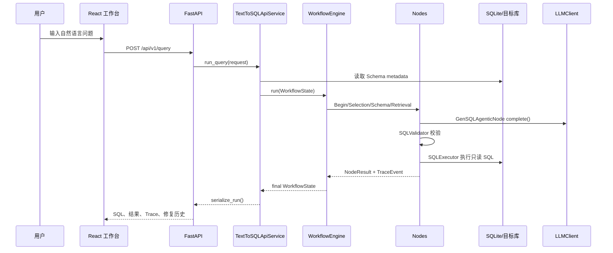

# 项目分析：AI 编程复盘证据

> 本文是**基于当前代码仓库反向复盘整理的重构版 Prompt / Prompt Playbook**配套分析，不是历史真实聊天记录，也不声称其中 Prompt 为当时逐字使用内容。

## 证据分级

| 类型 | 含义 | 本文写法 |
| --- | --- | --- |
| 真实代码证据 | 能在仓库文件、配置、测试或 Git 历史中直接看到 | 标注具体路径、模块、类或函数 |
| 合理推断 | 根据当前结构、commit message 和模块演进顺序推断 | 明确写“推断” |
| 待确认 | 仓库当前不能证明，需要人工补充背景 | 明确写“待确认” |

## 项目概览

该仓库是一个轻量级 Text-to-SQL Agent demo，面向运营/分析师自然语言查数，由数据团队维护可信上下文。后端通过可配置多阶段工作流完成 Schema Linking、上下文检索、SQL 生成、SQL 校验、SQL 执行、反思修复和 HITL 收敛，前端提供查询、运行配置、SQL 编辑执行、结果展示、历史、反馈和 Debug Trace。

真实证据：

- 项目定位写在 `README.md`：轻量业务交付版 / 面试级 demo，明确不包含认证、多租户、调度、BI 看板等重型能力。
- 默认工作流写在 `workflow.yaml`，包含 `begin -> selection -> schema_linking -> context_retrieval -> example_retrieval -> sql_generation -> sql_validation -> sql_execution -> finalization`，失败后进入 `reflection_decision`、`reflection_fix`、`reasoning_rewrite` 或 `hitl`。
- 后端入口是 `src/text_to_sql_demo/main.py` 的 `create_app()`。
- API 编排集中在 `src/text_to_sql_demo/api/service.py` 的 `TextToSQLApiService`。
- 前端入口是 `frontend/src/App.tsx`，API client 在 `frontend/src/api/client.ts`。

## 技术栈

| 层次 | 技术 | 证据 |
| --- | --- | --- |
| 后端语言 | Python 3.11+ | `pyproject.toml` 的 `requires-python = ">=3.11"` |
| API | FastAPI、Pydantic | `pyproject.toml` 依赖；`src/text_to_sql_demo/main.py` |
| Workflow | 自研 `WorkflowEngine` | `src/text_to_sql_demo/workflow/engine.py` |
| 节点系统 | `BaseNode`、`NodeRegistry`、`NodeFactory` | `workflow/node.py`、`workflow/registry.py`、`workflow/factory.py` |
| SQL | SQLAlchemy、SQLGlot、SQLite，扩展 PostgreSQL/MySQL | `sql/validator.py`、`execution/sql_executor.py`、`workflow.yaml` |
| LLM | Provider 无关 `LLMClient`，OpenAI-compatible adapter，Mock client | `llm/client.py`、`llm/providers.py`、`llm/factory.py` |
| 配置 | YAML + Pydantic config model | `workflow.yaml`、`config/models.py` |
| 检索 | YAML fallback 的 Top-K 词法检索 | `retrieval/examples.py`、`retrieval/knowledge.py` |
| 运行记录 | 内部 SQLite metadata store | `metadata/store.py` |
| 可观测性 | request_id、结构化日志、Trace、SQL hash 摘要 | `observability/`、`workflow/state.py` |
| 前端 | React 18、Vite、TypeScript、Vitest | `frontend/package.json`、`frontend/src/App.tsx` |
| 测试 | pytest、ruff、Vitest、TypeScript build | `pyproject.toml`、`frontend/package.json` |

## 核心模块

| 模块 | 关键文件 | 职责 | 体现的工程意识 |
| --- | --- | --- | --- |
| API 层 | `main.py`、`api/models.py`、`api/service.py` | HTTP 路由、请求校验、服务编排、错误响应 | 路由薄、服务集中、Pydantic 输入约束 |
| Workflow 核心 | `workflow/engine.py`、`workflow/state.py` | 按配置执行节点，记录 Trace，处理终止条件 | 引擎不导入具体节点，状态模型类型化 |
| 节点注册 | `workflow/registry.py`、`workflow/factory.py` | 按 node type 创建节点 | 避免 if/elif 分发，支持扩展 |
| 业务节点 | `nodes/*.py` | Schema、检索、生成、校验、执行、反思、修复、HITL | 每个节点职责单一，通过 `NodeResult` 传状态 |
| Prompt | `prompts/builder.py`、`configs/prompts/*.yaml` | 裁剪上下文，渲染生成/修复 Prompt | Prompt 不写在 API route，支持替换模板 |
| LLM | `llm/client.py`、`llm/factory.py`、`llm/providers.py` | Provider 抽象、默认 OpenAI-compatible、Mock 测试 | 不把业务绑定到具体供应商 |
| SQL 安全 | `sql/validator.py`、`nodes/sql_validation.py` | SQLGlot 解析、只读 SELECT、schema 引用校验 | 执行前做结构化防线 |
| 反思闭环 | `reflection/policy.py`、`nodes/error_reflection.py`、`nodes/sql_fix.py` | 错误分类、策略路由、修复历史、HITL | 修复有上限，失败可解释 |
| Metadata | `metadata/store.py`、`memory/trusted.py` | 运行记录、Trace、收藏 SQL、反馈 | 区分业务库和内部库 |
| Runtime config | `runtime/*.py` | 临时数据库和模型配置，`light/strong` 路由 | SecretStr、TTL、脱敏展示 |
| 前端工作台 | `frontend/src/App.tsx`、`components/*`、`api/*` | 查询、编辑 SQL、Runtime、历史、Debug Trace | 用户视角和开发者视角分离 |

## 主链路

## 已体现的项目级开发能力

1. 可配置工作流：`workflow.yaml` 配置节点、边、最大步数、最大修复次数、模型 alias 和数据库连接。
2. 节点扩展边界：`WorkflowEngine` 只依赖 `NodeFactory`，`NodeFactory` 只依赖 `NodeRegistry`，具体节点通过 `@register_node` 注册。
3. 类型约束：后端大量使用 Pydantic 模型；前端通过 TypeScript interface 定义 API 响应。
4. LLM 解耦：业务节点依赖 `LLMClient` 协议，测试使用 `MockLLMClient`。
5. Prompt 工程化：生成和修复 Prompt 模板放在 `configs/prompts/`，`PromptBuilder` 只注入裁剪后的上下文。
6. SQL 安全链路：SQLGlot parse、只读 SELECT、schema 引用校验、执行方言一致性检查。
7. 有限修复循环：`ReflectionDecisionNode` 在 `attempt_count >= max_attempts` 时输出 `attempts_exhausted`，进入 HITL。
8. 可观测性：每个节点生成 `TraceEvent`，日志输出 request_id、node_name、event，SQL 默认只记录 length/hash。
9. 测试覆盖：集成测试覆盖复杂查询成功、字段错误修复、三次失败终止；架构测试防止 engine/factory 依赖具体节点。
10. 产品化边界：README 明确当前是轻量 demo，不宣称认证、多租户、生产级权限隔离或性能指标。

## 面试可引用证据索引

| 能力主张 | 仓库证据 | 面试中可以这样说 | 诚实边界 |
| --- | --- | --- | --- |
| 我能把 AI 编程任务拆成架构模块 | `workflow.yaml`、`workflow/engine.py`、`workflow/state.py` | “我没有让 AI 写单脚本，而是先约束 workflow、state、node 和 trace。” | 不说这些 Prompt 是历史逐字记录 |
| 我会约束 AI 不破坏扩展边界 | `workflow/registry.py`、`workflow/factory.py`、`tests/unit/workflow/test_architecture_constraints.py` | “我用注册表和架构测试防止 engine/factory 依赖具体节点。” | 不说架构已经覆盖所有生产扩展场景 |
| 我会让 LLM 输出可测试 | `llm/client.py`、`llm/providers.py`、`tests/*llm*` | “真实 provider 被接口隔离，测试用 Mock LLM。” | 不说已经支持所有 provider |
| 我重视 SQL 安全 | `sql/validator.py`、`execution/sql_executor.py`、`tests/unit/sql` | “LLM SQL 必须先 parse、只读校验和 schema 校验再执行。” | 不说应用层校验等于生产数据库权限隔离 |
| 我会审查 AI 输出 | `tests/integration/test_demo_scenarios.py`、`observability/*`、`metadata/store.py` | “我要求测试覆盖成功、修复、终止，并检查日志脱敏和 trace。” | 不说 demo 已具备完整审计平台 |
| 我能做产品级演示 | `frontend/src/App.tsx`、`frontend/src/components/*`、`frontend/src/api/client.ts` | “前端能展示查询、SQL、结果、历史、反馈和 Debug Trace。” | 不说这是成熟 BI 产品 |

## 当前完成度

| 维度 | 当前状态 | 判断 |
| --- | --- | --- |
| MVP 可演示性 | 已具备自然语言查询、SQL 生成、校验执行、修复、Trace、前端工作台 | 较完整 |
| 工程化结构 | API、workflow、nodes、llm、sql、retrieval、runtime、metadata 分层明确 | 较强 |
| 测试 | 后端 unit/integration 较多，前端有 Vitest | 较强 |
| 生产部署 | 缺少 Docker/CI、认证、密钥托管、持久 runtime config | demo 级 |
| 数据安全 | 有 SQL 校验和脱敏日志，但不等于数据库权限隔离 | 需加固 |
| 检索质量 | 当前是 YAML/SQLite + 词法 Top-K fallback | 可演示，非高召回生产 RAG |
| 文档 | README 与 docs 较完整 | 有少量待同步风险 |

## 生产化短板

- Runtime config 使用 `RuntimeConfigStore` 内存字典，服务重启后失效。
- `InMemoryRunStore` 只适合当前进程回放，虽然 metadata store 能持久化摘要和响应 payload，但仍不是完整审计/归档系统。
- SQL 只读安全依赖应用层 SQLGlot 校验，生产上还需要数据库只读账号、网络隔离、statement timeout、行数限制和审计。
- OpenAI-compatible provider 可用，但多 provider 策略、重试、超时、熔断、预算控制仍可增强。
- Schema 来源以 introspection 为主，`SchemaConfig.catalog_source = yaml` 的配置模型存在，但主链路 YAML schema loader 待确认。
- 检索是词法 Top-K，没有 embedding/vector backend、召回评估或离线评测集。
- 前端 Runtime 配置存在基本表单和创建时连接测试，但缺少独立“测试连接”、更细的 provider 校验和密钥托管。
- CI/CD、Dockerfile、生产部署手册、监控指标、认证、多租户仍未实现。
- 待确认：当前工作区前端组件有未提交改动，部分既有 docs 的组件树可能需要同步。

## 推断的开发阶段

仓库存在 Git 历史，因此以下阶段是**基于 commit message 与当前代码结构的合理推断**：

1. 初始脚手架：`Initial text-to-sql agent demo`
2. 可配置真实 LLM 与结构化数据库连接：`接入可配置真实 LLM API`、`Add structured database connection config`
3. 可观测性与异常体系：`[observability] 增加日志系统与异常体系`
4. Runtime 配置：`[runtime] 增加运行时配置存储`、`[api] 增加运行时配置接口`
5. 前端演示：`[frontend] 增加运行配置面板`
6. Agentic 生成和 SQL 修复闭环：`[node] 补齐Agentic生成链路`、`[sql] 增强定向修复闭环`
7. 对齐 datus 思想和 metadata 沉淀：`[workflow] 对齐datus核心链路`、`[metadata] 增加运行记录沉淀`
8. 记忆体系和数据源发现：`[memory] 完善三层记忆架构`、`[data]新增数据库自动扫描`
9. 文档整理：`[docs]项目文档全量整理优化`

这些阶段不能描述为“历史真实 Prompt 顺序”，只能作为复盘时构造 Prompt Playbook 的工程化参考。
