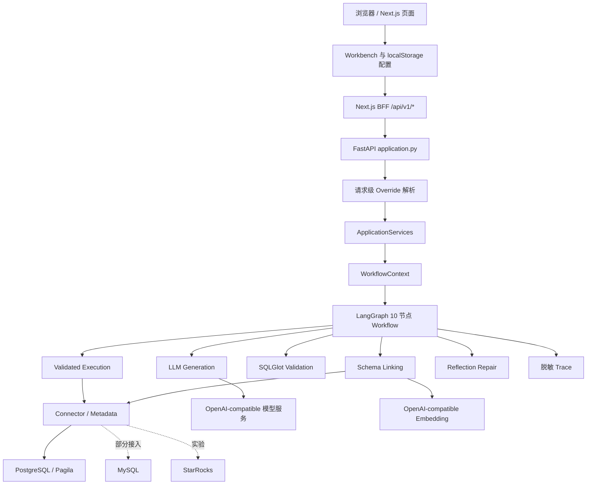
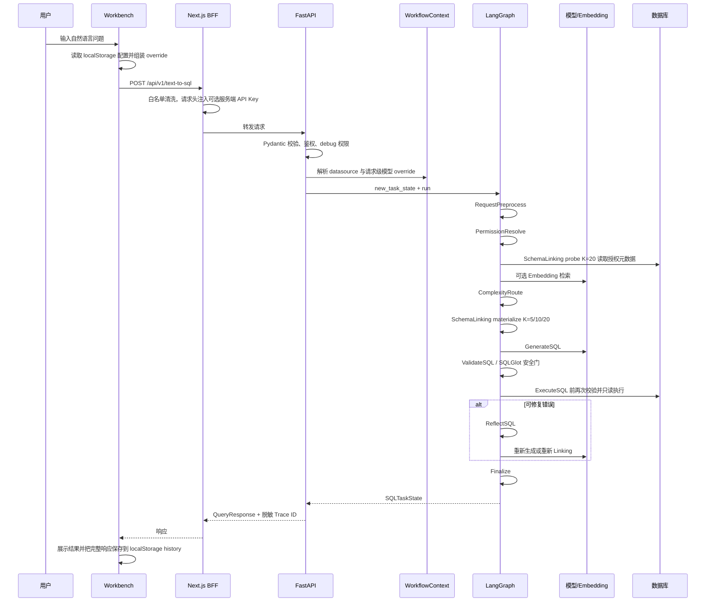

# Text-to-SQL Lite 当前架构与测试基线

> 阶段 0 只读审计文档
>
> 记录日期：2026-08-01
>
> 代码快照：`main` / `f9cba78`
>
> 结论范围：当前仓库真实实现，不代表后续阶段已经完成

> **历史基线说明**：本文主体是阶段 0 快照，用于追溯当时的架构、测试和漂移，
> 不应把其中的行号、未实施计划或 64/10 冲突当作当前状态。64/10 已裁决为 10；
> 当前实施结论以“阶段 1 实施后记”及文末阶段 2、阶段 3 状态附录为准。

## 阶段 1 实施后记

阶段 1 已完成代码可读性整理：

- 批次 1 将配置拆为 `app/config/`，保留公共导入兼容，并将显式 allowlist 放入
  `DatabaseSettings`。
- 批次 2 新增 Connector、模型 Provider 与 WorkflowContext 工厂，Bootstrap
  使用明确资源栈清理；Connector Registry 拒绝重复 ID 并脱敏关闭错误。
- 批次 3 将 FastAPI 装配、依赖和路由分离；模型摘要使用 Provider 公开属性，
  查询未预期异常仅记录白名单日志字段。

已解决的是配置/启动/API 入口职责混杂、Provider 私有设置读取、PyMySQL 未声明
和 integration marker 漏收集等阶段 1 范围问题。当前仍未完成本地 Profile、
动态连接生命周期、配置持久化和前端查询闭环；Embedding 仍是启动必需项。
MySQL 仅部分接入，数据库级只读设置失败后继续执行仍是 P0 风险；StarRocks 保持
实验状态。真实 MySQL/StarRocks、完整前端 E2E 和新的正式冻结资格证据均未完成。
本次只将非 Gold 合成校准冻结重新绑定到当前受控代码；历史 Pagila baseline 和
Gold 文件保持原样，该重绑定不代表正式资格通过。

阶段 1 最终回归实测：unit `1053 passed`、security `162 passed`、分支覆盖
`83%`、锁定 Pagila integration `91 passed, 9 skipped`、Python 全量
`1306 passed, 9 skipped`；前端 Vitest `49 passed`，typecheck 和 production
build 通过。lint 保持本阶段未触碰前端前的 `15 errors / 5 warnings` 基线。

## 1. 审计范围与结论

本次审计阅读并交叉核对了：

- 仓库目录、`README.md`、`RELEASE.md`、`pyproject.toml`、前后端配置和部署文件；
- `docs/Text-to-SQL项目复现规格.md` 的 MVP 编码入口及架构、API、配置、错误路由章节；
- `docs/Text-to-SQL测试与验收规格.md` 和 18 条 Pagila Case；
- FastAPI、Bootstrap、Connector、Schema Linking、Generation、Validation、Execution、Reflection、Workflow、Trace 的主链代码；
- Next.js 页面、BFF、设置、工作台、历史记录和全部 4 个前端测试文件；
- `tests/unit`、`tests/security`、`tests/integration` 的现有测试结构和实际运行结果。

按仓库规则，本次没有读取 `docs/Text-to-SQL原项目参考信息.md`，也没有从历史参考方案推导新功能。

一句话结论：**PostgreSQL/Pagila 的核心 Text-to-SQL 引擎和安全闭环已经较完整；“本地可插拔工具”的配置、动态连接和前端闭环尚未成立，当前最应该重构的是核心引擎外围的配置、API 与 Bootstrap，而不是重写 Workflow。**

当前最重要的事实如下：

1. PostgreSQL/Pagila 后端主链可以在锁定数据库上完整通过现有测试；SQL 校验、执行前二次校验、只读事务、有限修复和循环终止都是真实可达代码。
2. 当前前端默认查询路径不可用：默认 Pagila 配置会被当作内联数据源 override 发送；后端默认先以“ad-hoc 未开启”拒绝，即使开启也会因空 allowlist 或临时 Connector 未接线而拒绝。证据见 `frontend/lib/datasource-config.ts:L12-L31,L133-L136`、`frontend/components/workbench/Workbench.tsx:L100-L125`、`app/api/overrides.py:L150-L176`。
3. 模型 API Key、数据库密码和完整 DSN 仍以明文保存在浏览器配置 localStorage；普通表单模式查询会携带 API Key、数据库密码等 override，DSN 模式则只存不传、实际不生效。这与目标 Profile ID-only 接口冲突。证据见 `frontend/lib/model-config.ts:L28-L64`、`frontend/lib/datasource-config.ts:L33-L76`、`frontend/components/workbench/Workbench.tsx:L75-L125`。
4. MySQL Connector 源码已经存在，但方言没有贯穿生成、归一化和修复链路；StarRocks 缺少数据库级只读事务保证。当前只有 PostgreSQL/Pagila 可以作为正式基线。
5. `app/config.py`、`app/api/application.py`、`app/api/bootstrap.py` 是交接难度最高的三个外围热点；核心 Workflow 应暂时保留。

## 2. 仓库快照

### 2.1 Git 与工作区

| 项目 | 当前状态 |
|---|---|
| 分支 | `main`，跟踪 `origin/main` |
| HEAD | `f9cba78` |
| origin | `https://github.com/lingyunjie321/text-to-sql-lite.git` |
| 审计开始前已有修改 | `AGENTS.md`，属于用户现有修改，本次未触碰 |
| 阶段 0 新增文件 | 本文和 `docs/refactor-scope.md` |
| 业务代码改动 | 无 |

仓库中还跟踪了 11 个根目录 `.next/` 构建产物，但根 `.gitignore` 没有忽略 `/.next/`。这些文件不是运行时源码，应作为独立的低风险仓库清理项处理，不能与业务重构混为一谈。

### 2.2 目录职责

| 路径 | 当前职责 | 成熟度判断 |
|---|---|---|
| `app/api/` | FastAPI 契约、生命周期、override、响应映射和生产装配 | 正式入口，但职责混杂 |
| `app/connectors/` | PostgreSQL、MySQL、StarRocks、元数据和 Registry | PostgreSQL 正式；MySQL 部分接入；StarRocks 实验 |
| `app/schema_linking/` | BM25、Embedding、RRF、Rerank、索引和授权过滤 | 正式使用，启动层仍强制 Embedding |
| `app/generation/` | OpenAI-compatible Provider、Prompt、路由和上下文裁剪 | 正式使用；多模型路由偏高级 |
| `app/validation/` | SQLGlot AST、对象、字段和函数安全策略 | 正式使用 |
| `app/execution/` | 执行前二次校验和 Connector 调用边界 | 正式使用 |
| `app/reflection/` | 错误路由、SQL 指纹、有限修复 | 正式使用 |
| `app/workflow/` | LangGraph State、10 种节点和条件路由 | 正式使用，应冻结主结构 |
| `app/observability/` | 白名单 Trace 和节点计时 | 正式使用 |
| `frontend/` | Next.js 工作台、BFF、设置、历史和结果展示 | 页面可达；配置与查询闭环未完成 |
| `evaluation/` | Case、Comparator、基线和审核工具 | 正式评测基础设施 |
| `infrastructure/` | 锁定 Pagila Compose、初始化和语义 manifest | PostgreSQL/Pagila 基线 |
| `tests/` | unit、security、integration 三层测试 | Python 覆盖广；真实 MySQL/StarRocks 与前端 E2E 缺失 |
| `docs/` | 主规格、验收规格、历史设计和发布说明 | 多份文档与当前实现存在漂移 |

仓库扫描统计约为 355 个可分析文件、约 4.5 万行 Python 和约 5000 行 TypeScript/TSX。扫描环境缺少 AST/PageRank 辅助依赖，因此复杂度排序主要依据文件大小、导入关系、测试和人工阅读；历史热点还包含已经删除的旧路径，不能作为重构依据。`[NEEDS INVESTIGATION / 待核查]` 如需在后续阶段做精确依赖图，应在固定工具环境重新生成。

## 3. 当前运行架构

### 3.1 总体组件关系



目标中的 `Local Profile Service`、正式 `ConnectorFactory`、`RuntimeRegistry` 和 Profile CRUD 当前尚不存在。现有 `ConnectorRegistry` 只在启动时注册静态连接，不能完成配置更新、删除、重连和凭据生命周期。

### 3.2 应用启动链

1. `app/main.py` 在导入时调用 `create_app()`。
2. FastAPI lifespan 调用 `build_production_services()`，退出时调用 `ApplicationServices.close()`。`app/api/application.py:L126-L153`
3. Bootstrap 加载主数据库配置，解析允许范围，创建并打开 Connector，再注册到 `ConnectorRegistry`。`app/api/bootstrap.py:L334-L361`
4. Pagila 数据源额外加载锁定的语义 manifest。`app/api/bootstrap.py:L282-L306`
5. 可选 `datasources.json` 被加载并逐一建立额外 Connector。`app/api/bootstrap.py:L363-L398`
6. Bootstrap 加载 simple/standard/complex/fallback 模型配置并构造 Provider Registry 与路由。`app/api/bootstrap.py:L400-L416`
7. Bootstrap 无条件加载 Embedding 配置并构造共享 Provider。`app/api/bootstrap.py:L417-L419`
8. 每个数据源获得一个 `WorkflowContext` 和独立索引 Registry，最后包装为 traced runner。`app/api/bootstrap.py:L421-L445`

当前资源生命周期缺口：Connector 已经打开后，如果模型或 Embedding 创建失败，外围没有统一资源栈保证所有已打开连接都被关闭。另有两处配置错误被 `except Exception: pass` 静默当作“无配置”。证据见 `app/api/bootstrap.py:L210-L218,L363-L419`。

### 3.3 一次查询的完整调用链



代码入口与边界：

- 浏览器请求：`frontend/components/workbench/Workbench.tsx:L46-L169`；
- BFF 清洗与转发：`frontend/app/api/v1/text-to-sql/route.ts:L25-L68`；
- FastAPI 查询端点：`app/api/application.py:L212-L299`；
- 请求级 override：`app/api/overrides.py:L38-L190`；
- LangGraph 节点和路由：`app/workflow/graph.py:L23-L225`；
- SQLGlot 校验：`app/validation/sql_validator.py:L38-L164`；
- 执行前二次校验：`app/execution/service.py:L53-L93`；
- PostgreSQL 只读执行：`app/connectors/postgresql.py:L307-L382,L521-L561`；
- 响应映射：`app/api/response.py:L21-L191`。

### 3.4 核心 Workflow

当前 Workflow 是应该保留的核心资产：

```text
RequestPreprocess
→ PermissionResolve
→ SchemaLinking(probe K=20)
→ ComplexityRoute
→ SchemaLinking(materialize K=5/10/20)
→ GenerateSQL
→ ValidateSQL
→ ExecuteSQL
→ ReflectSQL（条件进入）
→ Clarification / Finalize
```

其主要安全与终止边界包括：

- Schema Linking 前先应用授权范围；
- 生成 SQL 和每次修复 SQL 都经过 SQLGlot 安全校验；
- 执行服务在 Connector 前再次校验，不信任前一节点的结果；
- 初始 SQL 后最多接受 3 个不同修复 SQL；
- SQL 指纹阻止重复和 A→B→A 循环；
- 权限、安全、连接、超时和资源错误不交给模型盲修；
- PostgreSQL 使用只读、Repeatable Read 事务，限制 statement timeout 和结果行数。

这些行为分别由 `app/workflow/graph.py`、`app/validation/sql_validator.py`、`app/execution/service.py`、`app/reflection/` 和 `app/connectors/postgresql.py` 实现，并有对应 unit/security/integration 测试。阶段 1 不应改动节点数量、State 结构、修复策略或 SQL 安全规则。

## 4. 对外接口现状

| 方法与路径 | 当前行为 | 备注 |
|---|---|---|
| `GET /health` | 静态返回 healthy | 不代表数据库或模型可用；`app/api/application.py:L155-L157` |
| `GET /api/v1/config` | 返回允许范围和模型摘要 | 当前未鉴权；前端 BFF 有代理但没有消费者 |
| `POST /api/v1/text-to-sql` | 执行完整 Workflow | Workflow 业务失败通常仍以 HTTP 200 + `status/error` 表达 |

当前 `QueryRequest` 有 6 个顶层字段：主规格中的 `question/datasource_id/schemas/debug`，以及代码新增的 `model_overrides/datasource_override`。`DatasourceOverride` 内部还能携带 `allowed_tables`、数据库用户名和密码；`ModelOverride` 内部可以携带 API Key。不存在顶层 `complexity_hint`。证据见 `app/api/models.py:L31-L114`。内联数据源分支按配置分别以“ad-hoc 未开启”“缺少 allowlist”或“connector builder 尚未接线”拒绝。`app/api/overrides.py:L138-L190`

当前前端还存在三个直接影响闭环的契约问题：

1. 默认数据库配置会形成必然被后端拒绝的内联 override；
2. 前端允许并发送 `fallback` override，后端请求校验只允许 `simple/standard/complex`，会返回 422；
3. DSN 模式只发送 datasource ID，用户保存的 DSN 不会用于建立连接。

这些是现状缺陷，不在阶段 0 修复；阶段 1 若坚持“只整理结构”，也不应偷偷夹带行为修改。

Next.js 三个 BFF 当前都没有显式超时或取消机制。查询 BFF 在后端未配置或不可达时包装为 HTTP 200 + `FAILED_INTERNAL`，health/config BFF 则返回 503；请求白名单会保留 `model_overrides.api_key` 和 `datasource_override.password`。证据见 `frontend/app/api/v1/text-to-sql/route.ts:L7-L103`、`frontend/app/api/v1/health/route.ts:L5-L22`、`frontend/app/api/v1/config/route.ts:L5-L16`。阶段 1 不改前端时，这些属于需要保持并记录的现有边界，而不是推荐的最终行为。

## 5. 测试基线

### 5.1 环境

| 工具 | 版本/状态 |
|---|---|
| Python | `.venv/bin/python` 3.12.7 |
| pytest | 9.1.1 |
| Node.js | 24.16.0 |
| npm | 11.13.0 |
| Docker | 29.5.3 |
| Docker Compose | 5.1.4 |
| Pagila | 仓库锁定 PostgreSQL 16.14 / Pagila 3.1.0，测试时容器 healthy |

测试使用仓库现有 `.venv` 和 `frontend/node_modules`。没有调用真实外部生成模型或 Embedding 服务。数据库测试只向 pytest 进程注入本地只读 Pagila DSN，没有把凭据写入本文。

### 5.2 权威基线

| 检查 | 结果 | 说明 |
|---|---:|---|
| `tests/unit` | `1019 passed` | 2.75 秒 |
| `tests/security` | `162 passed` | 1.04 秒 |
| unit + security | `1181 passed` | 分支覆盖率 82% |
| `tests/integration` | `91 passed, 9 skipped` | 使用锁定 Pagila；5 个 MySQL、4 个 StarRocks 真实实例测试因未配置对应 DSN 跳过 |
| Python 全量 | `1272 passed, 9 skipped` | 当前权威 Python 基线；11.07 秒 |
| 前端 Vitest | `49 passed` | 4 个测试文件 |
| 前端 TypeScript | 通过 | `npm run typecheck` |
| 前端生产构建 | 通过 | `npm run build`；因受限环境不允许 Turbopack 绑定端口，改在获准的本机执行环境验证 |
| 前端 ESLint | **失败：15 errors, 5 warnings** | 主要为 React 19 hooks/ref/purity 规则及未使用变量 |
| Python compileall | 通过 | `app evaluation tools tests` |
| `pip check` | 通过 | 当前虚拟环境没有破损依赖 |
| Compose 配置 | 通过 | 使用仓库 `.env` 和 Pagila compose |

覆盖率薄弱处与后续风险相符：MySQL 约 11%、StarRocks 约 16%、Bootstrap 约 64%、Connector Registry 约 60%。分支覆盖率 82% 不能替代真实 MySQL/StarRocks 或浏览器 E2E。

结果采集于 2026-08-01 CST。覆盖率数据写入被 Git 忽略的本地 `.coverage` 文件，复核命令 `.venv/bin/coverage report --format=total` 返回 `82`。本轮使用的主要命令如下，其中 DSN 仅在进程内注入：

```bash
.venv/bin/pytest -q -p no:cacheprovider tests/unit
.venv/bin/pytest -q -p no:cacheprovider tests/security
.venv/bin/pytest -q -p no:cacheprovider --cov=app --cov=evaluation --cov=tools --cov-branch tests/unit tests/security
TEXT_TO_SQL_DATABASE_DSN='<本地只读 Pagila DSN>' .venv/bin/pytest -q -p no:cacheprovider tests/integration
TEXT_TO_SQL_DATABASE_DSN='<本地只读 Pagila DSN>' .venv/bin/pytest -q -p no:cacheprovider tests

cd frontend
npm test
npm run typecheck
npm run lint
npm run build
```

### 5.3 非权威的诊断性失败

为避免把环境问题误报为代码回归，以下两次结果不计入基线：

- 未注入数据库 DSN 时运行 integration，产生 69 个缺少 `TEXT_TO_SQL_DATABASE_DSN` 的 setup error；受限执行环境还阻止 4 个本地 provider 协议测试绑定回环端口。后者在本机执行环境重跑为 `4 passed`。
- 把整个 `.env` 导入测试进程时，全量测试出现 7 个模型/Embedding 配置失败；原因是进程级环境变量覆盖了测试专用 env file。只注入数据库 DSN 后全量为 `1272 passed, 9 skipped`。

这说明测试命令应显式注入所需变量，不应无选择地 `source .env`。

### 5.4 尚未覆盖的关键场景

- 干净虚拟环境安装：`pyproject.toml:L9-L23` 未声明 `PyMySQL`，但 `app/connectors/__init__.py:L41-L44` 无条件导入 MySQL/StarRocks 模块，当前 `.venv` 中的 PyMySQL 是项目元数据之外的环境项；干净安装可能在 import/test collection 时失败。
- 真实 MySQL 和 StarRocks 合约、方言及只读边界；当前 9 个测试被跳过。
- 真实生成模型、真实 Embedding 和冻结 Gold 的最终质量门。
- 前端组件、页面、Route Handler、浏览器和前后端 E2E；现有 49 个用例仅覆盖配置 helper、DSN 解析、BFF 请求白名单和 health helper。
- 默认工作台请求是否能被后端接受；现有测试反而把默认数据库配置断言为“已配置”。`frontend/lib/datasource-config.test.ts:L171-L174`
- Profile CRUD、动态连接生命周期、BM25-only 启动和凭据不进入历史；这些能力尚未实现。
- integration marker 不完整且定义过窄：`pyproject.toml` 把它描述为“需要锁定 Pagila”，但现有标记还覆盖回环 HTTP、MySQL/StarRocks 和部分进程内测试；另有 13 个展开后的 Case 没有 marker。当前 README 和 CI 以目录运行可以覆盖它们，但 `pytest -m integration` 会静默漏测。
- CI 生成覆盖率报告但没有 `--cov-fail-under` 或 `fail_under`，阶段 1 拆文件后覆盖率下降也可能保持绿色。

## 6. 代码成熟度分类

### 6.1 正式使用、阶段 1 应保留

| 模块 | 判断 |
|---|---|
| PostgreSQL Connector | 连接池、重试、授权元数据、只读事务、超时、取消和结果上限完整 |
| SQLGlot Validation | 单 statement、只读 AST、对象、字段、函数和危险能力默认拒绝 |
| Validated Execution | Connector 前二次校验，避免节点状态绕过安全门 |
| LangGraph Workflow | 10 种节点、两阶段 Linking、显式复杂度路由、唯一终态 |
| Reflection Repair | 错误分类、最多 3 次不同修复、指纹和循环限制 |
| Schema Linking | BM25、Embedding、RRF、Rerank、授权过滤和索引版本隔离 |
| OpenAI-compatible LLM Provider | 请求限制、响应大小、结构化解析和错误转换完整 |
| Trace 与 Evaluation | 白名单 Trace、Comparator、冻结基线和 Gold 审核工具 |

### 6.2 实验或部分接入

| 模块 | 当前限制 |
|---|---|
| MySQL Connector | 有连接、元数据和执行代码，但 Prompt、SQL 规范化、指纹和 State 默认方言仍偏 PostgreSQL；只读设置失败还会被静默忽略 |
| StarRocks Connector | 通过 MySQL 协议接入，但没有数据库级只读事务保证，应继续标记实验 |
| `datasources.json` + `ConnectorRegistry` | 可在启动时注册额外数据源，但无 CRUD、替换关闭、失败重建或配置失效闭环 |
| 多模型路由 | 底层能力完整，但普通用户流程过重，前端还会发送敏感 override |
| 前端参考面板与图表 | 组件可达，但部分字段未映射或语义不准确；图表超出当前核心目标 |
| 前端 localStorage 设置 | 页面可保存，但不是正式后端配置，也不能建立动态连接 |

### 6.3 明确未完成

- ModelProfile、DatasourceProfile、SQLite Profile Store 和凭据内存态；
- 模型/数据源测试接口、CRUD 和 metadata 接口；
- RuntimeRegistry 的创建、替换、删除、重连和退出关闭；
- 内联 datasource override 的临时 Connector；
- BM25-only 启动：Linker 支持无 Embedding，但 Bootstrap 强制加载 Embedding；
- MySQL 完整方言贯穿和真实 E2E；
- 工作台模型/数据源选择器；
- Schema 自动读取和树形表选择；
- 历史恢复、澄清跳过和只存非敏感摘要；
- 一键启动和本地配置目录。

### 6.4 重复、遗留或失效

- `app/config.py` 中 `load_database_settings()` 重复定义：`L94-L99` 与 `L269-L274`；
- `DatabaseSettings` 通过动态 `_extra` 携带允许范围，Bootstrap 通过 `getattr` 读取隐藏契约：`app/config.py:L217-L229`、`app/api/bootstrap.py:L198-L208`；
- `connectors.models` 与 `connectors.types` 有两套值归一化，包入口保留 legacy 别名；
- `generation/service.py` 保留旧的直连 Provider 路径，而 Workflow 使用 routed generation；
- 根目录跟踪 `.next/` 生成文件；
- 前端存在未引用 `Card`、第二套 Toast、类型守卫和部分 helper；
- `frontend/.gitignore` 重复忽略 `.env`；
- 前端版本 `0.1.0` 与设置页显示 `v1.0.0` 不一致。

重复代码是否删除必须先验证真实引用；阶段 1 不应仅凭名称相似就合并 Connector 或核心生成逻辑。

## 7. 最影响可读性和交接的代码

### P0：`app/config.py`

697 行内同时包含数据库、允许范围、鉴权、LLM、模型路由、Embedding 和 JSON 配置读取；有重复 loader 和动态 `_extra`。新开发者无法从类型定义直接判断允许范围来自哪里，后续 Profile 也没有稳定落点。

### P0：`app/api/bootstrap.py`

一个函数同时读取配置、建立多个数据库连接、加载语义清单、构造模型、创建 Embedding、建立索引和组装 Context；错误处理与资源清理分散。任何中间步骤失败时，很难证明此前资源被正确关闭。

### P0：`app/api/application.py`

同一文件承担应用创建、lifespan、鉴权、依赖、三个路由、模型摘要、请求错误和业务异常映射；还通过 Provider 私有 `_settings` 获取展示信息。`app/api/application.py:L71-L91,L126-L299`

### P0：前端配置和查询存在“看起来可用、实际拒绝”的隐藏耦合

设置页把正式凭据存入 localStorage，工作台再转换成后端未完成的 override；“测试连接”按钮只是占位。最危险的不是代码行数，而是 UI 给出的完成感与真实运行能力不一致。

### P1：多方言信息没有贯穿上下文

Bootstrap 解析了方言但在两个调用点把返回值丢给 `_`；`new_task_state()` 默认 `postgres`，API 没有传入 Connector 方言。`app/api/bootstrap.py:L334-L378`、`app/workflow/models.py:L900-L916`。因此注册 MySQL/StarRocks 并不等于生成和修复链路支持相应方言。

### P1：错误处理与私有契约

- Bootstrap 两处 `except Exception: pass` 会把错误配置当成“没有配置”；
- MySQL/StarRocks 多个清理分支静默吞掉异常；
- MySQL 设置只读事务失败后仍继续执行，属于必须 fail closed 的安全风险；
- API 直接读取 LLM Provider 的 `_settings`；
- Workflow 通过 Connector 私有 `_consume_retry_count` 读取重试次数。

并非所有宽泛异常都应删除。Embedding 失败降级、Trace sink 隔离等路径有显式状态或 warning，是有意的故障隔离，应保留并测试。

## 8. 文档与实现漂移

| 文档声明 | 当前实现 | 影响 |
|---|---|---|
| README 只列 4 个查询字段，客户端不能指定模型或 allowlist：`README.md:L205-L217` | `QueryRequest` 已接受模型/数据源 override，前端也实际发送 | API 契约冲突，阶段 1 不能擅自选择删除或正式化 |
| README 说没有健康检查：`README.md:L219-L221` | 后端、BFF 和关于页均已接入 `/health` | 新人会错误判断运行状态能力 |
| README/规格/.env 规定 Embedding 批量上限 64：`README.md:L201`、主规格 `L649`、`.env.example:L83` | 代码使用 `Literal[10] = 10`，单测和冻结配置也固定为 10：`app/config.py:L624` | 明确规格冲突，修改配置前必须裁决 |
| 主规格要求缺少 Embedding 必要配置时 fail closed：`docs/Text-to-SQL项目复现规格.md:L665-L666` | 当前 Bootstrap 确实强制 Embedding；新本地工具目标要求后续可选 | 阶段 1 应保持现状；可选化留到阶段 4并先更新权威规格 |
| 测试规格称 18 条 Case 全是 draft：`docs/Text-to-SQL测试与验收规格.md:L285` | JSONL 与 RELEASE 是 16 verified / 2 draft | 验收文档过期 |
| 测试规格要求文本尾空格敏感：测试规格 `L212-L224` | Comparator v3 会 `rstrip()`，单测明确要求忽略尾空格 | 不能按旧规格“修复”当前 Comparator，需先裁决并统一 |
| RELEASE 基线为 1173 / 1264 / 81%：`RELEASE.md:L58-L64` | 当前为 1181 / 1272 / 82% | 发布证据未更新 |
| RELEASE 说仓库没有 LICENSE：`RELEASE.md:L244` | 根目录已有 `LICENSE`，README 声明 MIT | 法律状态描述错误 |
| README 项目结构没有 frontend | 当前已有完整 Next.js 工程和 BFF | 安装、启动、测试和交接说明缺失 |
| 旧前后端对齐报告称后端只有 2 个端点、扩展响应未实现、前端未用 health | 当前有 3 个端点，扩展响应大部分已映射，health 已使用 | 该报告应标记为历史资料，不能继续作为实现依据 |
| 前端设计声明历史可恢复 | 历史页只跳转 `?conversation=`，Workbench 不读取此参数 | UI 承诺与实现不一致 |
| 前端错误卡仍提示 EdgeOne Makers | 当前定位是 localhost 本地工具 | 产品定位漂移 |

另一个更大的规格层冲突是：现有主规格仍以固定 PostgreSQL/Pagila、后续统一扩展 MySQL/StarRocks 为主线，而当前目标要求 PostgreSQL/MySQL 正式支持、StarRocks 实验、本地 Profile 和可选 Embedding。当前用户目标优先指导后续计划，但在实现阶段 2～4 前，应先把新的本地工具契约写入权威规格，避免代码继续同时服从两套路线。

## 9. 当前主要风险

| 风险 | 等级 | 说明 |
|---|---:|---|
| 前端默认查询被后端拒绝 | P0 | 阻断本地用户最基本路径，现有前端单测未发现 |
| 凭据进入配置 localStorage 和普通 override 请求 | P0 | API Key、密码与 DSN 明文保存；API Key/表单密码还会传输，后续需迁移并清理旧配置 |
| 完整问题、SQL 和结果行进入历史 localStorage | P0 | 历史不保存 override 凭据，但保存完整响应，不符合“只存非敏感摘要”目标 |
| MySQL 只读设置失败被吞掉 | P0 | 可能在没有数据库级只读保障时继续执行 |
| 干净安装漏声明 PyMySQL | P0 | 当前环境通过不代表新开发者能按 README 安装运行 |
| Bootstrap 中途失败可能泄漏连接 | P0 | 缺少统一资源清理边界 |
| MySQL/StarRocks 被界面展示为可用但方言未贯穿 | P1 | 功能标签高于真实证据 |
| 文档与 API/测试漂移 | P1 | 容易让后续开发继续实现错误契约 |
| integration marker 与覆盖率无门槛 | P1 | 选择错误命令或拆文件后可能少跑测试而 CI 仍绿 |
| 前端 lint 基线失败 | P1 | TypeScript 可构建，但 React 19 规则问题会积累 |
| 根 `.next/` 构建产物被跟踪 | P2 | 增加提交噪声和交接干扰 |

## 10. 阶段 0 结论

必须重构的是：

- 配置职责、显式配置字段和兼容导出；
- API 路由与依赖边界；
- Connector、Model Provider、WorkflowContext 的创建职责；
- Bootstrap 的顺序、错误可见性和资源清理；
- Provider 的公开只读摘要接口；
- 干净安装依赖声明和结构相关测试。

暂时保留的是：

- LangGraph 节点、Workflow State 和主路由；
- Schema Linking 算法、SQL Generation、SQLGlot Validation；
- Validated Execution、PostgreSQL Connector、Reflection Repair；
- 现有 HTTP 路径和响应 JSON；
- 旧 override 兼容字段，直到 Profile API 有明确迁移方案；
- MySQL/StarRocks 源码，但不提升成熟度声明；
- 现有多模型路由底层能力，普通用户简化留到后续阶段。

阶段 1 的文件级计划、兼容方案、风险和验收标准见 `docs/refactor-scope.md`。

## 11. 阶段 2 实施后状态附录（2026-08-02）

以上第 1～10 节保留为阶段 0 的历史架构快照，其中关于配置单文件、API 未拆分、
Profile 不存在等表述不再代表当前实现。阶段 1 的结构整理状态见
`docs/refactor-scope.md` 末尾附录；本附录只记录本地工具阶段 2 带来的增量。

当前后端调用关系为：

```text
API
→ ModelProfileService / DatasourceProfileService
→ LocalProfileStore + InMemoryCredentialStore
→ StaticProfileResolver
→ 现有静态 WorkflowContext
→ Text-to-SQL Workflow
```

新增的 `app/local/` 明确承担五类职责：严格 Profile 模型、SQLite 非敏感持久化、
进程内凭据、模型/数据源 CRUD 服务，以及静态 runtime 解析。API 新增模型和
数据源各 5 个 CRUD 操作；查询请求新增 `model_profile_id`，Profile 模式只提交
两个 Profile ID，且不能与旧 override 混用。

阶段 2 没有新增动态资源所有权。`StaticProfileResolver` 只会返回 Bootstrap
已经创建、且公开身份与 Profile 完全匹配的 Context；不匹配就在进入 Workflow
前失败，不回退到默认 Context。旧 `model_overrides` / `datasource_override` 保留
兼容并标记 deprecated。

仍未完成且保持后续阶段边界的能力：

- 根据 DatasourceProfile 动态创建、替换和关闭 Connector；
- RuntimeRegistry、数据库测试连接和 metadata API；
- 根据 ModelProfile 动态创建 Provider、单模型默认路由和模型测试接口；
- Embedding 可选化与 BM25-only 启动；
- 前端 Profile 设置、工作台选择和 localStorage 凭据清理；
- MySQL 只读失败 fail closed 与真实 Sakila 验证。

阶段 2 的精确契约见 `docs/local-profile-phase2.md`。核心 Workflow、Schema
Linking、Prompt、Comparator、Gold 与前端业务代码均未修改。

## 12. 阶段 3 实施后状态附录（2026-08-03）

阶段 3 在阶段 2 的 Profile 契约上接通动态数据库，不改变核心 Workflow。当前
Profile-ID 查询链路为：

```text
POST /api/v1/text-to-sql
→ StaticProfileResolver（校验静态模型身份）
→ RuntimeRegistry（按 datasource_id 懒创建/复用）
→ DatasourceRuntimeService
→ ConnectorFactory
→ ProfileScopedConnector
→ WorkflowContextFactory
→ Text-to-SQL Workflow
```

数据源配置变化、删除和应用退出会使对应运行时失效并关闭 Connector；更新完成后
Registry 还会拒绝用先前读取的旧 Profile 重新缓存运行时。动态运行时建立失败
不会缓存；后续请求可以重试。应用没有默认数据库配置时仍可启动并提供
Profile API，但旧普通查询安全拒绝，不会自动选用任意 Profile。

结构发现与查询授权是两条独立路径：

```text
连接测试 / metadata API
└── 临时 raw Connector → 全部可发现非系统结构 → 立即关闭

查询
└── RuntimeRegistry → ProfileScopedConnector → Profile allowlist
```

metadata 返回确定性排序的 Schema、表/视图、字段、类型、nullable、主键和外键，
不返回样例数据或数据库实现细节；固定容量上限为 500 个关系、10,000 个字段、
5,000 个外键和共享的 30 秒端到端预算。它不会修改 allowlist。创建或 PUT 数据源
时，服务会用临时 Connector 在线确认 allowlist 是当前可发现对象的子集；查询仍会再次校验范围，
任何空、失效或不匹配都 fail closed。

MySQL 已贯通独立方言、Prompt 版本、SQLGlot 校验、只读事务和真实 Sakila 执行。
测试环境固定 MySQL 8.4.10 镜像 digest 与 MySQL 官方 Sakila 1.5 归档 Hash；应用账号
只授予 Sakila 的 `SELECT` / `SHOW VIEW`。StarRocks 继续实验且不进入动态 Profile。

阶段 3 新增或明确的职责：

| 模块 | 职责 |
|---|---|
| `app/connectors/catalog.py` | 全量非系统 metadata 发现、容量限制和 allowlist 在线校验 |
| `app/connectors/scoped.py` | 在 Connector 边界固定 Profile 授权范围 |
| `app/local/datasource_runtime.py` | 临时连接测试、发现、验证与动态 Context 组装 |
| `app/local/runtime_registry.py` | 动态 runtime 的懒创建、复用、失效、重试和关闭 |
| `app/api/routes/datasources.py` | 数据源测试、CRUD 与 metadata HTTP 契约 |
| `app/local/profile_resolver.py` | 静态兼容 Context 或动态 runtime 的 fail-closed 选择 |

仍未完成且不属于阶段 3：动态 Model Provider、模型测试接口、Embedding 可选化、
BM25-only 启动、前端 Profile 闭环和凭据持久化。精确设计与错误码见
`docs/local-datasource-phase3.md`。

## 13. 阶段 4 实施后状态附录（2026-08-03）

阶段 4 在动态数据库链路上增加动态模型运行时，不改变 LangGraph、Workflow
State、SQL 生成契约、SQLGlot 安全门或修复节点。当前 Profile-ID 查询链为：

```text
POST /api/v1/text-to-sql
→ StaticProfileResolver（读取两个 Profile）
→ RuntimeRegistry（动态 Connector）
  + ModelRuntimeRegistry（动态模型与可选 Embedding）
→ WorkflowContextFactory（组合请求上下文）
→ Text-to-SQL Workflow
```

一个 ModelProfile 只创建一个生成 Provider，并确定性映射到 simple、standard、
complex 三条主路由；动态 Profile 不启用 fallback。模型 Profile 更新、Key 更新或
删除都会使对应缓存失效，下一次查询按新身份重建。静态多模型路由和 deprecated
override 仍仅用于兼容旧路径，不参与 Profile 模式的回退。

模型连接测试新增 `POST /api/v1/local/models/test`。它接收不含 ID/name 的临时配置，
执行一次最小结构化生成，并在配置 Embedding 时执行单文本向量调用。临时对象不会
写入 SQLite、Credential Store、Runtime Registry、Trace 或查询历史。生成失败返回
稳定脱敏的 422/503/504；Embedding 失败返回 HTTP 200、`embedding=unavailable`，
明确表示 BM25-only 仍可用。

启动配置现在按完整组可选：没有静态数据库、LLM 或 Embedding 环境变量时应用仍可
启动并提供 Profile API。远程 endpoint 必须使用 HTTPS；`localhost` 与 IP loopback
允许 HTTP。生成与 Embedding Key 均可省略，此时 Provider 不发送 Authorization
Header，适用于本地 Ollama、vLLM、LM Studio 等 OpenAI-compatible 服务。

Embedding 策略为：

```text
未配置 → WorkflowContext.retrieval_runtime = None → BM25-only
已配置且可用 → BM25 + Embedding + Fusion
已配置但出现批准的超时/连接/限流/无效响应 → 同一授权范围与 Schema 版本内降级 BM25
```

阶段 4 新增或明确的职责：

| 模块 | 职责 |
|---|---|
| `app/local/model_runtime.py` | 从 Profile 构造单模型路由、可选 Embedding，并执行临时连接测试 |
| `app/local/model_runtime_registry.py` | 按 Profile 与进程内 Key 修订号缓存、失效模型 runtime |
| `app/local/profile_resolver.py` | 将动态数据库与动态模型组合成请求级 WorkflowContext |
| `app/api/routes/models.py` | 模型测试与 CRUD 的脱敏 HTTP 边界 |
| `app/api/bootstrap.py` | 允许静态数据库/模型/Embedding 配置组分别缺省并统一清理资源 |

阶段 4 后仍未完成的是前端模型设置、默认模型选择、工作台 Profile 选择以及旧
localStorage 敏感配置迁移；这些属于阶段 5。API Key 和数据库密码仍只在当前进程
内存中保存，重启后需要重新输入；阶段 4 没有引入 Keychain 或其他持久化 Secret。
精确设计与实施计划见 `docs/superpowers/specs/2026-08-03-local-model-phase4-design.md`
和 `docs/superpowers/plans/2026-08-03-local-model-phase4.md`。

阶段 4 完成时的本机验证证据：Python compileall 通过；unit + security
`1443 passed`，分支覆盖率 `86%`；回环 OpenAI-compatible 生成/Embedding、
Embedding 超时降级及合成评测 `10 passed`；`pip check` 无破损依赖；前端 Vitest
`49 passed`，production build 通过。真实 Pagila 未执行，因为当前进程未设置
`TEXT_TO_SQL_DATABASE_DSN`；MySQL 本地配置存在但 53306 服务未启动，因此本轮不把
真实 PostgreSQL/MySQL E2E 计为通过。非 Gold 的 Stage 1 合成校准 freeze 已按当前
受控代码重新绑定；Pagila Gold Case、正式 baseline 与历史参考文档均未修改。
