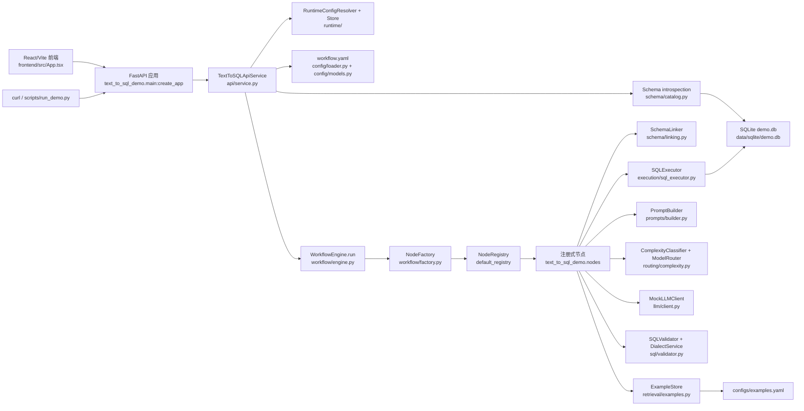

# 整体架构

本文档描述当前仓库真实实现，不包含规划态目录或未落地模块。项目目标是展示一个清晰、可测试、可配置的 Text-to-SQL Agent 主链路：API 接收自然语言问题，工作流节点按配置流转，Mock LLM 生成 SQL，SQLGlot 校验，SQLAlchemy 执行 SQLite，只读结果和 Trace 返回给前端或 API 调用方。

## 架构全景图

先看 plaintext 版，适合在终端、Git diff 或不渲染 Mermaid 的阅读器里直接阅读：

```text
┌──────────────────────────────────────────────────────────────────────────────┐
│                         Text-to-SQL Agent Demo 系统架构图                    │
└──────────────────────────────────────────────────────────────────────────────┘

                             ┌──────────────────────┐
                             │     User Request      │
                             │ Frontend / curl / CLI │
                             └───────────┬──────────┘
                                         │
                             ┌───────────▼──────────┐
                             │     FastAPI App       │
                             │ main.py:create_app    │
                             └───────────┬──────────┘
                                         │
                             ┌───────────▼──────────┐
                             │ TextToSQLApiService   │
                             │ api/service.py        │
                             └───────────┬──────────┘
                                         │
         ┌───────────────────────────────┼───────────────────────────────┐
         │                               │                               │
         ▼                               ▼                               ▼
┌──────────────────┐           ┌──────────────────┐           ┌──────────────────┐
│ Runtime Config   │           │ Schema Metadata  │           │ Workflow Runtime │
│ runtime/         │           │ schema/catalog.py│           │ WorkflowEngine   │
└────────┬─────────┘           └────────┬─────────┘           └────────┬─────────┘
         │
┌────────▼─────────┐
│ Config Layer     │
│ workflow.yaml    │
└────────┬─────────┘
         │                              │                              │
         │                              │                    ┌─────────▼─────────┐
         │                              │                    │ NodeFactory       │
         │                              │                    │ + NodeRegistry    │
         │                              │                    └─────────┬─────────┘
         │                              │                              │
         │                              │                    ┌─────────▼─────────┐
         │                              │                    │ Registered Nodes  │
         │                              │                    │ text_to_sql_demo  │
         │                              │                    │ .nodes            │
         │                              │                    └─────────┬─────────┘
         │                              │                              │
         │                              │     ┌────────────────────────┼────────────────────────┐
         │                              │     │                        │                        │
         │                              │     ▼                        ▼                        ▼
         │                              │ ┌──────────────┐      ┌──────────────┐        ┌──────────────┐
         │                              │ │ SchemaLinker │      │ ExampleStore │        │ GenerateSQL  │
         │                              │ │ schema/      │      │ retrieval/   │        │ Node         │
         │                              │ │ linking.py   │      │ examples.py  │        │              │
         │                              │ └──────┬───────┘      └──────┬───────┘        └──────┬───────┘
         │                              │        │                     │                       │
         │                              │        │                     │        ┌──────────────┼──────────────┐
         │                              │        │                     │        ▼              ▼              ▼
         │                              │        │                     │ ┌────────────┐ ┌────────────┐ ┌────────────┐
         │                              │        │                     │ │ Complexity │ │ Prompt     │ │ Mock LLM   │
         │                              │        │                     │ │ Router     │ │ Builder    │ │ Client     │
         │                              │        │                     │ └────────────┘ └────────────┘ └────────────┘
         │                              │        │                     │
         │                              │        │                     │
         │                              │        ▼                     ▼
         │                              │ ┌────────────────────────────────────────────┐
         │                              │ │ SQL Validation / Execution                 │
         │                              │ │ SQLValidator + DialectService + SQLExecutor│
         │                              │ └────────────────────┬───────────────────────┘
         │                              │                      │
         └──────────────────────────────┼──────────────────────┼──────────────────────────────┐
                                        │                      │                              │
                                        ▼                      ▼                              ▼
                         ┌──────────────────────┐   ┌──────────────────────┐   ┌──────────────────────┐
                         │ SQLite demo.db       │   │ configs/examples.yaml│   │ API Response / Trace  │
                         │ data/sqlite/demo.db  │   │ Top-K SQL examples   │   │ serialize_run         │
                         └──────────────────────┘   └──────────────────────┘   └──────────────────────┘
```

Mermaid 渲染版如下：



维护提示：如果新增 API 入口、节点目录、数据源、LLM adapter 或前端调用方式，需要同步更新 plaintext 版、Mermaid 版和下方模块职责表；不要把尚未实现的模块画进架构图。

## 分层职责

| 层次 | 真实路径 | 当前职责 |
| --- | --- | --- |
| 前端演示 | `frontend/src/` | 提交自然语言问题、展示 SQL/结果/修复提示/开发者 Trace，通过 Vite proxy 调用 `/api`。 |
| API 层 | `src/text_to_sql_demo/main.py`、`src/text_to_sql_demo/api/models.py` | 定义 FastAPI app、请求模型、统一错误响应和现有接口。 |
| 应用服务 | `src/text_to_sql_demo/api/service.py` | 加载配置、初始化数据库、读取 schema、创建 `WorkflowEngine`、序列化运行结果和内存运行记录。 |
| 运行时配置 | `src/text_to_sql_demo/runtime/` | 管理前端创建的临时数据库和 `light/strong` 模型路由配置，解析为请求级 workflow 依赖。 |
| 配置层 | `workflow.yaml`、`src/text_to_sql_demo/config/` | 用 Pydantic 校验 workflow、nodes、edges、database、models、dialect、trace 等配置引用。 |
| 工作流核心 | `src/text_to_sql_demo/workflow/` | 提供 `WorkflowState`、`NodeResult`、`BaseNode`、`NodeRegistry`、`NodeFactory`、`WorkflowEngine`。 |
| 业务节点 | `src/text_to_sql_demo/nodes/` | 实现 schema linking、example retrieval、SQL generation、validation、execution、reflection/fix、finalization。 |
| LLM 抽象 | `src/text_to_sql_demo/llm/` | 定义 provider 无关协议和 deterministic `MockLLMClient`，测试不依赖真实付费 API。 |
| Prompt 与路由 | `src/text_to_sql_demo/prompts/`、`src/text_to_sql_demo/routing/` | 只用 linked schema 和 Top-K examples 构造 prompt，根据复杂度选择模型 alias。 |
| Schema 与检索 | `src/text_to_sql_demo/schema/`、`src/text_to_sql_demo/retrieval/` | 从数据库 introspection 读取 schema，本地规则 linking，本地 YAML 示例 Top-K 词法检索。 |
| SQL 校验执行 | `src/text_to_sql_demo/sql/`、`src/text_to_sql_demo/execution/` | SQLGlot 方言解析/转换、只读 SELECT 和 schema 校验，SQLAlchemy 执行 SQLite。 |
| 测试 | `tests/`、`frontend/src/**/*.test.tsx` | 覆盖架构约束、节点、SQL 校验、API、修复闭环、demo 场景和前端交互。 |

维护提示：新增核心模块时，先确认它属于哪一层；如果职责跨层，优先在文档中说明依赖方向，避免后续把 prompt、数据库执行或工作流流转写进 API handler。

## 工作流核心设计

`WorkflowEngine.run` 只认识配置、`NodeFactory` 和 `NodeResult.outcome`。它不会导入具体节点类，也不会按节点类型写 `if/elif` 分支；这些约束由 `tests/unit/workflow/test_architecture_constraints.py` 做 AST 检查。

节点创建流程是：

1. `TextToSQLApiService.__init__` 导入 `text_to_sql_demo.nodes`，触发各节点上的 `@register_node(...)` 装饰器。
2. `NodeFactory.create` 从 `NodeRegistry` 按 `NodeConfig.type` 取节点类。
3. `WorkflowEngine.run` 执行节点，合并 `NodeResult.state_patch` 到 `WorkflowState`。
4. `WorkflowEngine._resolve_next_node` 根据当前节点的 outcome 和 `workflow.yaml` 的 `edges` 决定下一节点。

维护提示：如果修改 `WorkflowEngine`、`NodeFactory` 或节点注册方式，必须同步检查 `tests/unit/workflow/test_registry_factory.py`、`tests/unit/workflow/test_engine.py` 和架构约束测试，并更新本文档。

## 状态与 Trace

`WorkflowState` 是 typed Pydantic model，但业务中间结果集中放在 `state.data`：

- 输入和配置快照：`schema`、`target_dialect`、`max_repair_attempts`、`debug`。
- 生成上下文：`schema_linking`、`retrieved_examples`、`available_example_count`、`prompt_summary`。
- SQL 状态：`generated_sql`、`current_sql`、`validated_sql`、`validation_result`。
- 执行与修复：`execution_result`、`last_error`、`repair_instruction`、`repair_history`、`attempt_count`。
- 最终输出：`final_status`、`final_sql`、`final_result`、`final_error`、`termination_reason`。

每个节点执行后，`WorkflowEngine._execute_node` 追加 `TraceEvent`，包含 `node_name`、`node_type`、`status`、`outcome`、`duration_ms`、`input_summary`、`output_summary` 和错误摘要。Trace 只记录摘要，避免把完整 prompt 或凭据放进响应。

维护提示：如果新增 `state.data` 键、改变 API 序列化字段或调整 trace 摘要，需要同步更新 [SQL 生成过程代码追踪](SQL生成过程代码追踪.md)、[工作流文档](文本转SQL工作流.md) 和前端 `frontend/src/api/types.ts`。

## 数据与外部依赖边界

默认数据库来自 `workflow.yaml` 的 `database.connections.demo_sqlite.fallback_url`：`sqlite:///data/sqlite/demo.db`。如果设置了 `DEMO_DATABASE_URL`，`TextToSQLApiService` 会优先使用环境变量。SQLite 数据由 `scripts/init_db.py` 或 `TextToSQLApiService.ensure_database` 初始化，schema 通过 SQLAlchemy inspector 读取。

当前 LLM 默认是 `MockLLMClient`。模型配置只暴露 `light`、`strong` 这样的 alias，业务代码不直接绑定供应商模型名。现有 `src/text_to_sql_demo/llm/providers.py` 只是 provider adapter 配置模型，不代表已经接入真实在线 LLM。

维护提示：如果将来接入真实 LLM、PostgreSQL 执行或新的 schema 来源，应先更新配置说明和限制说明，再扩展测试，避免 README 误导为当前已具备生产能力。
