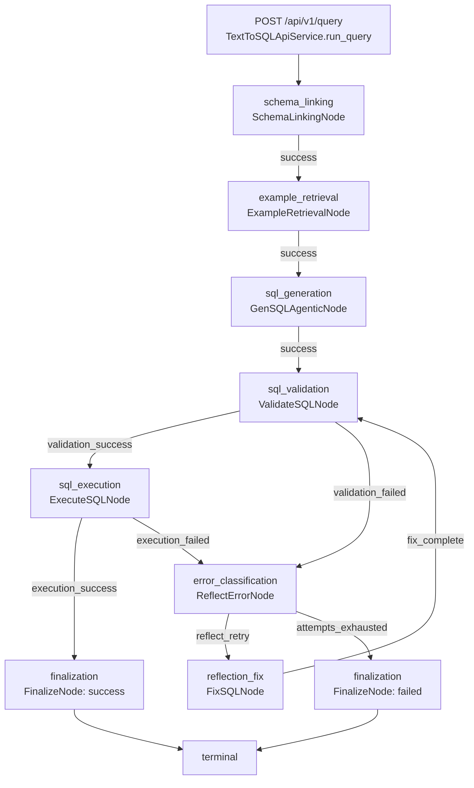

# Text-to-SQL 工作流

本文档描述 `workflow.yaml` 与当前节点实现的真实流转。工作流由 `WorkflowEngine.run` 执行，节点顺序不写在 API handler 中，而是由配置中的 `edges` 根据 `NodeResult.outcome` 决定。

## 当前配置入口

默认配置文件是仓库根目录的 `workflow.yaml`：

- `workflow.start_node`: `schema_linking`
- `workflow.max_steps`: `30`
- `workflow.max_repair_attempts`: `3`
- `database.default`: `demo_sqlite`
- `models.aliases`: `light`、`strong`，当前默认 provider 为 `openai_compatible`
- `schema.catalog_source`: `database`
- `retrieval.examples_path`: 默认 `configs/examples.yaml`，请求级配置构建时会注入到 `example_retrieval` 节点

维护提示：如果修改 `workflow.yaml` 的节点名、outcome 边或最大尝试次数，必须同步更新本文档、[面试演示场景](面试演示场景.md) 和相关集成测试。

## 节点与职责

| 配置节点 | 实现类 | 主要输入 | 主要输出 | 成功/失败 outcome |
| --- | --- | --- | --- | --- |
| `schema_linking` | `SchemaLinkingNode` | `user_question`、`state.data.schema` | `schema_linking` | `success` |
| `example_retrieval` | `ExampleRetrievalNode` | 问题、linked tables、`configs/examples.yaml` | `retrieved_examples`、`available_example_count` | `success` |
| `sql_generation` | `GenSQLAgenticNode` | 问题、linked schema、examples、业务方言范式、LLM client、model profiles | `generated_sql`、`selected_model`、`prompt_summary` | `success` |
| `sql_validation` | `ValidateSQLNode` | `generated_sql/current_sql`、schema、dialect | `validated_sql` 或 `last_error` | `validation_success`、`validation_failed` |
| `sql_execution` | `ExecuteSQLNode` | `validated_sql`、database URL | `execution_result` 或 `last_error` | `execution_success`、`execution_failed` |
| `error_classification` | `ReflectErrorNode` | `last_error`、`attempt_count` | `repair_instruction`、`repair_instruction.strategy` 或 `termination_reason` | `reflect_retry`、`attempts_exhausted` |
| `reflection_fix` | `FixSQLNode` | `repair_instruction`、LLM client、model profile | 新 SQL、`repair_history`、`attempt_count`，历史中记录 `strategy_name` | `fix_complete` |
| `finalization` | `FinalizeNode` | `execution_result`、错误状态 | `final_status`、`final_sql`、`final_result/final_error` | `finalize_success`、`finalize_failed` |

维护提示：如果新增节点或给现有节点增加新的 outcome，需要同步更新 `workflow.yaml`、本表、plaintext/Mermaid 图和 `tests/unit/workflow/test_engine.py`。

## 流转图

先看 boxed plaintext 版，适合不渲染 Mermaid 的阅读场景：

```text
┌──────────────────────────────────────────────────────────────────────────────┐
│                       Text-to-SQL 工作流流转图                               │
└──────────────────────────────────────────────────────────────────────────────┘

                             ┌──────────────────────┐
                             │ POST /api/v1/query   │
                             │ QueryRequest         │
                             └───────────┬──────────┘
                                         │
                             ┌───────────▼──────────┐
                             │ schema_linking       │
                             │ SchemaLinkingNode    │
                             └───────────┬──────────┘
                                         │ success
                             ┌───────────▼──────────┐
                             │ example_retrieval    │
                             │ ExampleRetrievalNode │
                             └───────────┬──────────┘
                                         │ success
                             ┌───────────▼──────────┐
                             │ sql_generation       │
                             │ GenSQLAgenticNode    │
                             └───────────┬──────────┘
                                         │ success
                             ┌───────────▼──────────┐
                             │ sql_validation       │
                             │ ValidateSQLNode      │
                             └──────┬─────────┬─────┘
                                    │         │
                  validation_success│         │validation_failed
                                    │         ▼
                                    │  ┌──────────────────────┐
                                    │  │ error_classification │
                                    │  │ ReflectErrorNode     │
                                    │  └──────┬─────────┬─────┘
                                    │         │         │
                                    │reflect_retry      │attempts_exhausted
                                    │         │         ▼
                                    │         │  ┌──────────────────────┐
                                    │         │  │ finalization         │
                                    │         │  │ FinalizeNode failed  │
                                    │         │  └───────────┬──────────┘
                                    │         │              │ terminal
                                    │         ▼              ▼
                                    │  ┌──────────────────────┐
                                    │  │ reflection_fix       │
                                    │  │ FixSQLNode           │
                                    │  └───────────┬──────────┘
                                    │              │ fix_complete
                                    │              └──── back to sql_validation
                                    │
                                    ▼
                             ┌──────────────────────┐
                             │ sql_execution        │
                             │ ExecuteSQLNode       │
                             └──────┬─────────┬─────┘
                                    │         │
                  execution_success │         │ execution_failed
                                    │         └──── to error_classification
                                    ▼
                             ┌──────────────────────┐
                             │ finalization         │
                             │ FinalizeNode success │
                             └───────────┬──────────┘
                                         │ terminal
                                         ▼
                                  ┌────────────┐
                                  │ API Result │
                                  │ + Trace    │
                                  └────────────┘
```

Mermaid 渲染版如下：



维护提示：这两个图必须只表达真实配置和真实节点。若改动 `edges` 中的 `on_validation_success`、`on_execution_failed` 等键名，plaintext 版、Mermaid 版和下方路径说明要一起改。

## 成功路径

一次成功路径为：

1. `TextToSQLApiService.run_query` 初始化数据库、读取 schema，创建 `WorkflowState`。
2. `WorkflowEngine.run` 从 `schema_linking` 开始执行。
3. `SchemaLinkingNode.run` 使用 `SchemaLinker` 选出相关表列。
4. `ExampleRetrievalNode.run` 使用 `ExampleStore` 返回 Top-K 本地 SQL 示例。
5. `GenSQLAgenticNode.run` 完成复杂度分类、模型 alias 路由、业务方言范式检索、prompt 构建和 LLM 调用；默认服务按 `workflow.yaml` 构造 OpenAI-compatible client，测试和 demo 脚本可注入 Mock。
6. `ValidateSQLNode.run` 用 SQLGlot 校验语法、方言、只读 SELECT 和 schema 引用。
7. `ExecuteSQLNode.run` 用 SQLAlchemy 执行已校验 SQL，执行方言必须受支持并与校验方言一致。
8. `FinalizeNode.run` 收敛 `final_status=success`、`final_sql` 和 `final_result`。

成功路径集成测试见 `tests/integration/test_api_workflow.py` 和 `tests/integration/test_demo_scenarios.py`。

维护提示：如果修改 `TextToSQLApiService.run_query` 的初始化数据、`GenSQLAgenticNode.run` 的内部步骤或 `serialize_run` 的响应字段，需要同步更新本节和 [SQL 生成过程代码追踪](SQL生成过程代码追踪.md)。

## 修复路径

修复路径覆盖 SQL 校验失败和执行失败：

1. `ValidateSQLNode.run` 或 `ExecuteSQLNode.run` 返回失败 outcome，并把结构化 `SQLError` 写入 `state.data.last_error`。
2. `ReflectErrorNode.run` 读取 `last_error`，如果 `attempt_count < max_repair_attempts`，按错误类型生成 `RepairStrategy` 并写入 `repair_instruction`。
3. `FixSQLNode.run` 使用 `strong` 模型 alias 和模板化修复 prompt 调用 LLM，prompt 中包含定向策略，写入新 `generated_sql/current_sql`。
4. `attempt_count` 加 1，并把 old/new SQL、错误类型、原因和 `strategy_name` 写入 `repair_history`。
5. 工作流回到 `sql_validation`，成功后继续执行并 finalization。

当前实现没有单独的错误分类目录；`ReflectErrorNode` 同时注册为 `error_reflection` 和 `error_classification`，负责把 SQL 错误整理成修复指令。

维护提示：如果将来拆出独立错误分类节点，必须更新本节、`workflow.yaml` 的 node type、plaintext/Mermaid 图、`tests/integration/test_sql_repair_workflow.py` 和 README 的核心能力说明。

## 终止路径

终止路径有两类：

- 修复次数耗尽：`ReflectErrorNode.run` 发现 `attempt_count >= max_repair_attempts`，返回 `attempts_exhausted`，进入 `finalization`，最终 `final_status=failed`、`termination_reason=attempts_exhausted`。
- 最大步骤保护：`WorkflowEngine.run` 发现 `step_count >= workflow.max_steps`，直接 `terminate("max_steps_exceeded")`。这是配置死循环保护。

当前 SQL 写入、DDL、多语句等会在 `SQLValidator` 中被拒绝为 `dialect_error`，并按配置进入修复流程；是否把安全错误改成不可修复，需要后续扩展 error category 和 edge 策略。

维护提示：如果调整 `max_attempts` 请求上限、`WorkflowSection.max_repair_attempts` 默认值或不可修复错误策略，应同步更新终止路径说明和终止路径测试。

## Trace 输出

每个节点执行后都会追加一条 `TraceEvent`。API 响应中的 trace 字段来自 `serialize_run`：

- `node_name` / `node_type`
- `start_time` / `end_time` / `duration_ms`
- `status` / `outcome`
- `input_summary`
- `output_summary`
- `error`

Trace 由 engine 自动记录，不需要每个节点手写计时逻辑。`input_summary` 和 `output_summary` 会压缩长字符串和列表，只保留演示所需摘要。

维护提示：如果改变 `TraceEvent` 字段或序列化结构，要同步更新前端 `TraceEventPayload`、`GenerationDetails` 展示逻辑和本文档。
