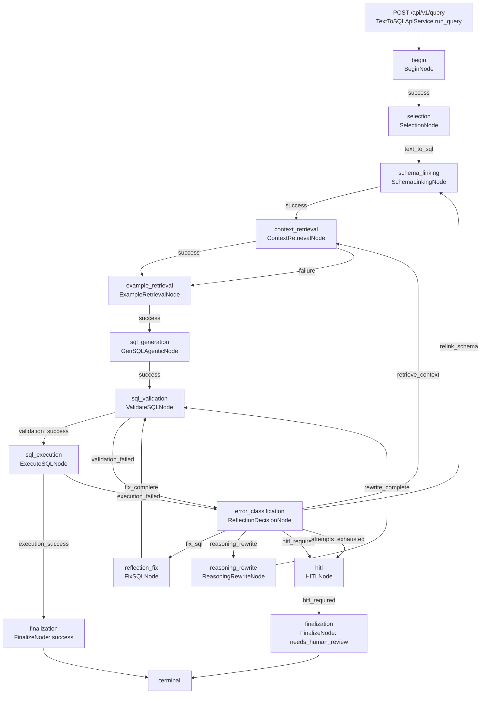

# Text-to-SQL 工作流

本文档描述 `workflow.yaml` 与当前节点实现的真实流转。工作流由 `WorkflowEngine.run` 执行，节点顺序不写在 API handler 中，而是由配置中的 `edges` 根据 `NodeResult.outcome` 决定。

## 当前配置入口

默认配置文件是仓库根目录的 `workflow.yaml`：

- `workflow.start_node`: `begin`
- `workflow.max_steps`: `30`
- `workflow.max_repair_attempts`: `3`
- `database.default`: `demo_sqlite`
- `models.aliases`: `light`、`strong`，当前默认 provider 为 `openai_compatible`
- `schema.catalog_source`: `database`
- `retrieval.examples_path`: 默认 `configs/examples.yaml`，请求级配置构建时会注入到 `example_retrieval` 节点
- `retrieval.knowledge_path`: 默认 `configs/knowledge.yaml`，请求级配置构建时会注入到 `context_retrieval` 节点

## 节点与职责

| 配置节点 | 实现类 | 主要输出 | 成功/失败 outcome |
| --- | --- | --- | --- |
| `begin` | `BeginNode` | `task` | `success` |
| `selection` | `SelectionNode` | `intent` | `text_to_sql` |
| `schema_linking` | `SchemaLinkingNode` | `schema_linking` | `success` |
| `context_retrieval` | `ContextRetrievalNode` | `rag_context` | `success` |
| `example_retrieval` | `ExampleRetrievalNode` | `retrieved_examples` | `success` |
| `sql_generation` | `GenSQLAgenticNode` | `generated_sql`、`selected_model`、`prompt_summary` | `success` |
| `sql_validation` | `ValidateSQLNode` | `validated_sql` 或 `last_error` | `validation_success` / `validation_failed` |
| `sql_execution` | `ExecuteSQLNode` | `execution_result` 或 `last_error` | `execution_success` / `execution_failed` |
| `error_classification` | `ReflectionDecisionNode` | `reflection_decision`、`sql_contexts` | `fix_sql` / `relink_schema` / `retrieve_context` / `reasoning_rewrite` / `hitl_required` / `attempts_exhausted` |
| `reflection_fix` | `FixSQLNode` | 新 SQL、`repair_history` | `fix_complete` |
| `reasoning_rewrite` | `ReasoningRewriteNode` | 新 SQL | `rewrite_complete` |
| `hitl` | `HITLNode` | `final_status=needs_human_review` | `hitl_required` |
| `finalization` | `FinalizeNode` | `final_status`、`final_sql`、`final_result/error` | `terminal` |

详细输入输出和 state.data 键见 [SQL 生成过程代码追踪](SQL生成过程代码追踪.md)。

## 流转图

plaintext 版（适合不渲染 Mermaid 的阅读场景）：

```text
┌─────────────────────────────────────────────────────────────┐
│                    Text-to-SQL 工作流流转图                   │
└─────────────────────────────────────────────────────────────┘

  POST /api/v1/query
         │
         ▼
  ┌──────────────┐
  │ begin        │ ── success ──┐
  └──────────────┘              ▼
                        ┌──────────────┐
                        │ selection    │ ── text_to_sql ──┐
                        └──────────────┘                  ▼
                                              ┌──────────────────┐
                                              │ schema_linking   │
                                              └────────┬─────────┘
                                    success ────────────┤
                                                       ▼
                                              ┌──────────────────┐
                                              │ context_retrieval│
                                              └────────┬─────────┘
                                    success ────────────┤
                                                       ▼
                                              ┌──────────────────┐
                                              │ example_retrieval│
                                              └────────┬─────────┘
                                    success ────────────┤
                                                       ▼
                                              ┌──────────────────┐
                                              │ sql_generation   │
                                              └────────┬─────────┘
                                    success ────────────┤
                                                       ▼
                                              ┌──────────────────┐
                       ┌──── validation_failed │ sql_validation   │
                       │                       └────────┬─────────┘
                       │              validation_success │
                       │                                ▼
                       │                       ┌──────────────────┐
                       │     execution_failed  │ sql_execution    │
                       │            ┌──────────│                  │
                       │            │          └────────┬─────────┘
                       │            │     execution_success│
                       │            │                     ▼
                       │            │            ┌──────────────────┐
                       │            │            │ finalization     │ ──► terminal
                       │            │            │ (success)        │     API Result + Trace
                       │            │            └──────────────────┘
                       ▼            ▼
              ┌─────────────────────────────┐
              │ error_classification        │
              │ (ReflectionDecisionNode)    │
              └──┬───────┬───────┬──────┬───┘
                 │       │       │      │
        fix_sql  │  relink  retrieve  reasoning_rewrite
                 │  _schema _context       │
                 │       │       │      │
                 ▼       │       │      ▼
        ┌────────────┐   │       │  ┌──────────────────┐
        │reflection_ │   │       │  │reasoning_rewrite │
        │fix         │   │       │  └────────┬─────────┘
        └─────┬──────┘   │       │           │
              │          │       │   rewrite_complete
       fix_complete      │       │           │
              │          │       │           │
              │     回到 schema   回到 context │
              │     _linking     _retrieval  │
              │                                │
              └──────────────┬─────────────────┘
                             ▼
                     回到 sql_validation

  另两条终止分支:
    error_classification ── hitl_required / attempts_exhausted ──► hitl ──► finalization (needs_human_review)
    WorkflowEngine step_count >= max_steps ──► terminate("max_steps_exceeded")
```

Mermaid 渲染版如下：



## 成功路径

一次成功路径为：

1. `TextToSQLApiService.run_query` 初始化数据库、读取 schema，创建 `WorkflowState`。
2. `WorkflowEngine.run` 从 `begin` 开始执行。
3. `BeginNode.run` 初始化任务上下文，把问题和 request_id 写入 `task`。
4. `SelectionNode.run` 做意图分类，当前默认输出 `text_to_sql`，后续可以扩展其他意图分支。
5. `SchemaLinkingNode.run` 使用 `SchemaLinker` 选出相关表列。
6. `ContextRetrievalNode.run` 使用 `KnowledgeStore` 返回 Reference SQL、文档片段、Metric、Semantic Model 的 Top-K `rag_context`。
7. `ExampleRetrievalNode.run` 使用 `ExampleStore` 返回 Top-K 本地 SQL 示例。
8. `GenSQLAgenticNode.run` 完成复杂度分类、模型 alias 路由、RAG 上下文/业务方言范式检索、prompt 构建和 LLM 调用；默认服务按 `workflow.yaml` 构造 OpenAI-compatible client，测试和 demo 脚本可注入 Mock。
9. `ValidateSQLNode.run` 用 SQLGlot 校验语法、方言、只读 SELECT 和 schema 引用。
10. `ExecuteSQLNode.run` 用 SQLAlchemy 执行已校验 SQL，执行方言必须受支持并与校验方言一致。
11. `FinalizeNode.run` 收敛 `final_status=success`、`final_sql` 和 `final_result`。

成功路径集成测试见 `tests/integration/test_api_workflow.py` 和 `tests/integration/test_demo_scenarios.py`。

## 策略反思闭环

策略反思闭环覆盖 SQL 校验失败和执行失败：

1. `ValidateSQLNode.run` 或 `ExecuteSQLNode.run` 返回失败 outcome，并把结构化 `SQLError` 写入 `state.data.last_error`。
2. `ReflectionDecisionNode.run` 读取 `last_error`、`current_sql/generated_sql` 和尝试次数，写入 `reflection_decision`，并把本轮 SQL 尝试追加到 `sql_contexts`。
3. 策略路由由 `workflow.yaml` 决定：`FIX_SQL -> reflection_fix`，`RELINK_SCHEMA -> schema_linking`，`RETRIEVE_CONTEXT -> context_retrieval`，`REASONING_REWRITE -> reasoning_rewrite`，`HITL/STOP -> hitl`。
4. `FixSQLNode` 和 `ReasoningRewriteNode` 都会把最近 3 轮 SQLContext 摘要放进 prompt；摘要只包含 SQL hash/长度、错误类型、策略和原因。
5. `FixSQLNode` 或 `ReasoningRewriteNode` 产出新 SQL 后回到 `sql_validation`，成功后继续执行并 finalization。

当前实现保留向后兼容注册名：`error_reflection`、`error_classification` 和 `reflection_decision` 都指向策略反思节点。它不会在运行中动态插入节点，只通过 `NodeResult.outcome` 和配置边路由。

## 终止路径

终止路径有两类：

- 修复次数耗尽：`ReflectionDecisionNode.run` 发现 `attempt_count >= max_repair_attempts`，返回 `attempts_exhausted`，进入 `HITLNode` 后再到 `finalization`，最终 `final_status=needs_human_review`、`termination_reason=attempts_exhausted`。
- 最大步骤保护：`WorkflowEngine.run` 发现 `step_count >= workflow.max_steps`，直接 `terminate("max_steps_exceeded")`。这是配置死循环保护。

当前 SQL 写入、DDL、多语句等会在 `SQLValidator` 中被拒绝为 `dialect_error`，并按配置进入修复流程；是否把安全错误改成不可修复，需要后续扩展 error category 和 edge 策略。

## Trace 输出

每个节点执行后都会追加一条 `TraceEvent`。API 响应中的 trace 字段来自 `serialize_run`：

- `node_name` / `node_type`
- `start_time` / `end_time` / `duration_ms`
- `status` / `outcome`
- `input_summary`
- `output_summary`
- `error`

Trace 由 engine 自动记录，不需要每个节点手写计时逻辑。`input_summary` 和 `output_summary` 会压缩长字符串和列表，只保留演示所需摘要。

API 响应会额外返回 `reflection_decision`、脱敏后的 `sql_contexts`、`hitl_required` 和 `hitl_reason`。其中 SQLContext 只暴露 SQL 长度与 hash，不暴露完整 SQL 或完整结果集。

维护规范见 [文档维护规范](文档维护规范.md)。
