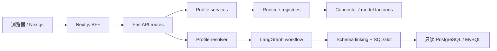

# 架构说明

## 运行结构

统一启动器只编排两个 Web 进程，不进入业务依赖图。前端通过 BFF 访问后端；Profile
服务负责非敏感 CRUD，Credential Store 只保存当前进程内 Secret。Runtime Registry
按 Profile ID 懒创建并复用连接或模型运行时，更新、删除和退出时使旧资源失效。

## 一次 Profile 查询

1. API 接收问题、`datasource_id` 与 `model_profile_id`；
2. Resolver 读取两个 Profile 与内存凭据，拒绝缺失、失效或不匹配状态；
3. Registry 创建或复用 Connector、模型路由和可选 Embedding runtime；
4. Workflow 在 Profile allowlist 内完成 Schema Linking；
5. 模型生成 SQL，SQLGlot 执行只读、对象、字段和函数校验；
6. Connector 在只读事务中执行，最多 30 秒、1000 行；
7. 可修复错误最多生成三个不同修复，最终形成结构化响应与脱敏 Trace。

Workflow 不读取 SQLite、前端状态或 HTTP 请求对象。配置与连接的依赖方向始终是
API → Local Services → Factory/Registry → WorkflowContext → Workflow。

## 生命周期

`text-to-sql-lite start` 创建 Uvicorn 与 Next.js 子进程。Uvicorn lifespan 创建
Profile Store、Credential Store、静态资源和两个 Registry；退出时逆序关闭模型
runtime、动态 Connector、静态 Connector，最后清空凭据。单个 close 失败不会阻止
其余资源释放。

## 支持边界

- PostgreSQL、MySQL：正式动态 Profile；StarRocks：实验代码，不进入 Profile。
- 单用户本地运行；无注册、登录、多租户或云端 Secret 管理。
- Embedding 可选，缺省为 BM25-only。
- 前端模型 Profile 已闭环；前端数据源 Profile 与 Workbench Profile 选择仍是阶段 5
  后续切片，当前使用 API。
