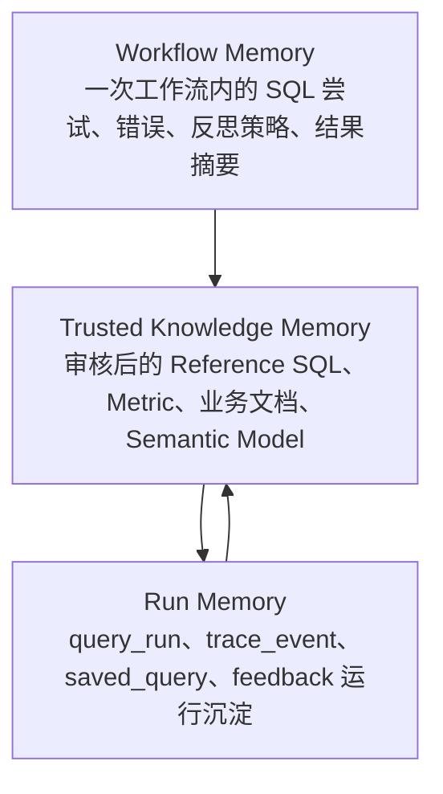

# 记忆架构与模块设计

本文说明当前项目的轻量三层 Memory 设计。这里的 Memory 不是聊天机器人式长期对话记忆，而是面向 Text-to-SQL 的“可信上下文 + 反思轨迹 + 运行沉淀”。

## Memory 目标

当前项目的 Memory 服务于三个目标：

1. 让一次 workflow 内的 SQL 尝试、错误、反思策略和执行结果摘要可解释。
2. 只把数据团队审核后的可信 SQL / 指标 / 业务知识注入生成上下文。
3. 把 query_run、trace、saved_query 和 feedback 沉淀到内部 metadata store，支持回放、反馈和后续治理。

它不负责保存用户长期聊天偏好，也不做会话自动 compact。

## 三层架构

三层之间的关系是轻量协作，而不是复杂平台化依赖：

- Workflow Memory 只在一次 workflow 内辅助生成、修复、重写和最终解释。
- Trusted Knowledge Memory 只接收可信候选，例如 YAML knowledge 和 `status="approved"` 的 saved_query。
- Run Memory 保存运行事实和治理入口，但不会把 draft saved_query 自动注入 prompt。
- `SUCCESS` SQLContext 是单次 workflow 的成功收敛记录，主要用于回放、解释和 trace 关联；它不会自动成为跨运行可复用知识。
- 跨运行进入 SQL 生成上下文的路径是：`saved_query -> draft -> 数据团队审核 -> approved -> Trusted Reference SQL`。

## 模块职责

| 模块 | 记忆职责 |
| --- | --- |
| `reflection/models.py` | 定义 `SQLAttemptContext`、`ReflectionDecision` 和反思策略模型。 |
| `reflection/policy.py` | 生成失败 SQL 尝试记忆、成功 `SUCCESS` 记忆，并提供 API/Prompt 共用的脱敏摘要。 |
| `nodes/error_reflection.py` | 在校验或执行失败后写入失败 SQLAttemptContext，并根据错误类型决定修复、重链 Schema、重检索、重写或 HITL。 |
| `nodes/reasoning_rewrite.py` | 使用最近的 SQLContext 记忆辅助重新推理生成 SQL。 |
| `nodes/finalization.py` | 在成功收敛时追加或更新最终 SQL 的 `SUCCESS` workflow memory。 |
| `retrieval/knowledge.py` | 从 YAML fallback 加载 Reference SQL、文档、Metric 和 Semantic Model，并做词法 Top-K 检索。 |
| `nodes/context_retrieval.py` | 合并 YAML knowledge 与 approved saved_query 的可信 Reference SQL，写入 `rag_context`。 |
| `memory/trusted.py` | 将 approved saved_query 转成 `ReferenceSqlItem`，并做 name/sql 去重和 Top-K 合并。 |
| `metadata/models.py` | 定义 query_run、trace_event、saved_query、feedback 等 Run Memory 记录模型。 |
| `metadata/store.py` | 使用内部 SQLite/SQLAlchemy 保存 Run Memory，并支持按 saved_query status 过滤。 |
| `api/service.py` | 注入 metadata_store 给节点，序列化运行响应，保存 query_run 与 trace_event。 |

## 已具备能力

- `SQLAttemptContext` 保存一次 workflow 内的 SQL 尝试记忆。
- `reflection_decision` 保存错误类型、反思策略、原因、置信度和尝试上限。
- SQLContext 会以脱敏形式进入 Prompt，包含 SQL length/hash、错误摘要、策略和原因。
- 成功 finalization 会写入 `reflection_strategy="SUCCESS"` 的最终 SQL 记忆，用于当前运行回放和解释。
- `query_run`、`trace_event`、`saved_query`、`feedback` 已作为 Run Memory 保存。
- 普通 saved_query 默认保存为 `draft`；只有通过轻量审核入口更新为 `approved` 后，才可作为可信 Reference SQL 进入后续 `rag_context.reference_sql`。

## 明确边界

- 不引入 AdvancedSQLiteSession。
- 不做 node_name memory 目录。
- 不做自动 compact。
- 不默认让用户保存的 draft saved_query 污染 prompt。
- 只有 approved 知识才进入 SQL 生成上下文。
- `SUCCESS` SQLContext 不自动升级为 approved knowledge。
- 不引入 LangChain / LangGraph。
- 不引入复杂认证、多租户、scheduler、BI dashboard 或 MCP 工具体系。

后续优化方向（成功后反思、字段探索、知识审核 UI、可选向量检索）统一见 [完成度分析](完成度分析.md)。

维护规范见 [文档维护规范](文档维护规范.md)。
