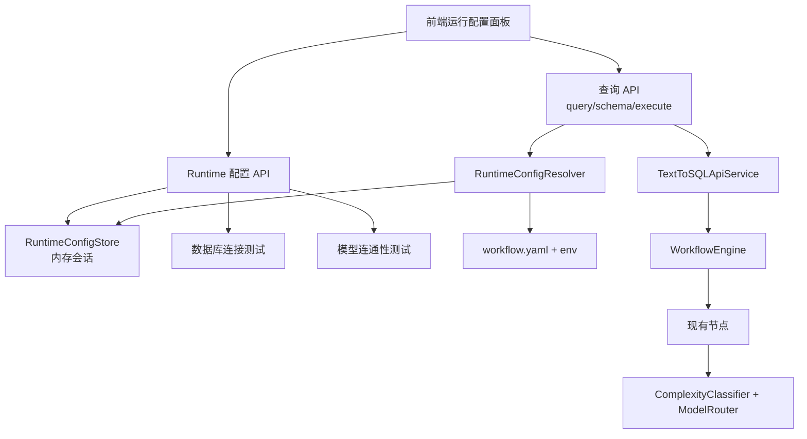

# 运行时数据库与模型路由配置方案

本文档是运行时配置能力的正式设计方案，后续实施计划以此为依据。

## 1. 背景

当前项目是 Text-to-SQL Agent demo，默认通过 `workflow.yaml` 配置数据库连接、`light` 和 `strong` 两档模型 alias。后端根据问题复杂度动态路由：简单问题使用 `light`，复杂问题和修复路径使用 `strong`。现有配置是服务启动时加载的静态配置，前端不能在页面中动态配置数据库连接或模型。

本方案目标是在保持现有工作流核心不变的前提下，支持前端页面配置数据库连接，并同时配置 `light` 与 `strong` 两档模型。配置生效后，查询、Schema 读取和编辑 SQL 执行都使用同一个运行时配置会话。

## 2. 设计目标

1. 前端可以选择系统预置数据库连接，也可以填写自定义数据库连接。
2. 前端必须同时配置轻量模型 `light` 和强模型 `strong`。
3. `light` 与 `strong` 允许来自不同 provider、不同 base URL、不同 API Key。
4. 系统预置模型优先通过环境变量读取 API Key。
5. 用户自定义模型可以一次性输入 API Key，后端只在内存运行时会话中短期保存，不落盘、不回传。
6. 数据库密码采用同样策略：系统连接走环境变量，自定义连接可一次性输入密码，只存内存会话。
7. 不改变 `WorkflowEngine`、`NodeFactory`、`NodeRegistry` 的职责。
8. 保留不传 `runtime_config_id` 时的默认 demo 行为。
9. 所有敏感信息必须脱敏，不能进入响应、日志、Trace 或文档示例。

## 3. 非目标

第一版不实现以下能力：

1. 用户登录、认证、多租户或权限系统。
2. API Key、数据库密码的持久化密钥管理。
3. 配置列表的长期保存、删除、共享和审计。
4. Redis、向量数据库或其他分布式基础设施。
5. 生产级数据库权限隔离。SQL 执行仍以 demo 只读校验为主。
6. 模型市场或复杂 provider 插件系统。

## 4. 推荐方案

采用“运行时配置会话”方案。



前端创建配置后获得 `runtime_config_id`。后续请求带上该 id，后端解析出本次使用的数据库 URL、目标 SQL 方言、`RoutingLLMClient` 和 `light/strong` 模型配置。工作流节点仍然只看到稳定 alias：`light` 和 `strong`。

## 5. 后端接口设计

### 5.1 获取系统选项

```http
GET /api/v1/runtime/options
```

返回前端配置页面可选的预置数据库和预置模型。

```json
{
  "database_presets": [
    {
      "id": "demo_sqlite",
      "display_name": "SQLite Demo",
      "driver": "sqlite",
      "has_password": false,
      "source": "workflow"
    }
  ],
  "model_presets": {
    "light": [
      {
        "id": "deepseek-v4-flash",
        "display_name": "DeepSeek v4 Flash",
        "provider": "openai_compatible",
        "model": "deepseek-v4-flash",
        "api_key_source": "env",
        "api_key_env": "DEEPSEEK_API_KEY"
      }
    ],
    "strong": [
      {
        "id": "deepseek-v4-pro",
        "display_name": "DeepSeek v4 Pro",
        "provider": "openai_compatible",
        "model": "deepseek-v4-pro",
        "api_key_source": "env",
        "api_key_env": "DEEPSEEK_API_KEY"
      }
    ]
  }
}
```

响应只返回环境变量名称和脱敏摘要，不返回真实 API Key 或数据库密码。

### 5.2 测试数据库连接

```http
POST /api/v1/runtime/database/test
```

预置连接请求：

```json
{
  "mode": "preset",
  "preset_id": "demo_sqlite"
}
```

自定义连接请求：

```json
{
  "mode": "custom",
  "config": {
    "driver": "postgresql",
    "host": "localhost",
    "port": 5432,
    "database_name": "analytics",
    "username": "readonly_user",
    "password": "runtime only",
    "query": {
      "sslmode": "prefer"
    }
  }
}
```

成功响应：

```json
{
  "success": true,
  "driver": "postgresql",
  "display_name": "localhost/analytics",
  "schema_summary": {
    "table_count": 12,
    "tables": ["orders", "customers"]
  }
}
```

### 5.3 测试模型路由配置

```http
POST /api/v1/runtime/models/test
```

请求必须同时包含 `light` 和 `strong`。

```json
{
  "light": {
    "mode": "preset",
    "preset_id": "deepseek-v4-flash"
  },
  "strong": {
    "mode": "custom",
    "provider": "openai_compatible",
    "model": "gpt-4.1",
    "base_url": "https://api.openai.com/v1/chat/completions",
    "api_key": "runtime only"
  }
}
```

成功响应：

```json
{
  "success": true,
  "light": {
    "status": "ok",
    "model": "deepseek-v4-flash"
  },
  "strong": {
    "status": "ok",
    "model": "gpt-4.1"
  }
}
```

第一版测试模型连通性时使用极小 prompt，不带业务 Schema 和用户问题。测试环境必须能用 Mock 或 monkeypatch 替代真实 provider。

### 5.4 创建运行时配置

```http
POST /api/v1/runtime/configs
```

请求示例：

```json
{
  "database": {
    "mode": "custom",
    "config": {
      "driver": "postgresql",
      "host": "localhost",
      "port": 5432,
      "database_name": "analytics",
      "username": "readonly_user",
      "password": "runtime only"
    }
  },
  "models": {
    "light": {
      "mode": "preset",
      "preset_id": "deepseek-v4-flash"
    },
    "strong": {
      "mode": "custom",
      "provider": "openai_compatible",
      "model": "gpt-4.1",
      "base_url": "https://api.openai.com/v1/chat/completions",
      "api_key": "runtime only"
    }
  }
}
```

成功响应：

```json
{
  "runtime_config_id": "rt_abc123",
  "expires_at": "2026-06-23T12:30:00Z",
  "database": {
    "driver": "postgresql",
    "display_name": "localhost/analytics"
  },
  "models": {
    "light": {
      "provider": "openai_compatible",
      "model": "deepseek-v4-flash"
    },
    "strong": {
      "provider": "openai_compatible",
      "model": "gpt-4.1"
    }
  }
}
```

### 5.5 业务接口使用运行时配置

现有接口增加可选 `runtime_config_id`：

```http
POST /api/v1/query
GET /api/v1/schema?runtime_config_id=rt_abc123
POST /api/v1/sql/execute
```

`POST /api/v1/query` 示例：

```json
{
  "question": "统计订单金额",
  "target_dialect": "postgres",
  "max_attempts": 3,
  "debug": true,
  "runtime_config_id": "rt_abc123"
}
```

不传 `runtime_config_id` 时，继续使用当前 `workflow.yaml` 默认配置。

## 6. 后端模块划分

新增模块建议：

```text
src/text_to_sql_demo/runtime/
├── __init__.py
├── models.py
├── store.py
├── resolver.py
└── tester.py
```

职责：

| 模块 | 职责 |
| --- | --- |
| `runtime.models` | 定义运行时配置请求、响应和内部模型。 |
| `runtime.store` | 内存保存 `RuntimeConfig`，支持 TTL 和过期清理。 |
| `runtime.resolver` | 把 preset/custom 配置解析为数据库 URL、目标方言、LLM client 和模型 profiles。 |
| `runtime.tester` | 测试数据库连接和模型连通性，返回脱敏摘要。 |

现有模块调整：

| 文件 | 修改点 | 是否影响 workflow/node/state |
| --- | --- | --- |
| `src/text_to_sql_demo/api/models.py` | 增加 runtime 请求/响应模型或引用 runtime models。 | 影响 API 请求结构，不直接影响节点。 |
| `src/text_to_sql_demo/main.py` | 注册 runtime API 路由。 | 不影响 workflow core。 |
| `src/text_to_sql_demo/api/service.py` | 按请求解析运行时配置，向节点注入本次依赖。 | 影响 workflow 依赖注入，不改变节点接口。 |
| `src/text_to_sql_demo/llm/` | 增加 `RoutingLLMClient`。 | 节点仍调用统一 `LLMClient` 协议。 |
| `frontend/src/api/` | 增加 runtime API client 和类型。 | 前端请求增加 runtime config。 |

## 7. 内部运行时模型

运行时配置：

```python
class RuntimeConfig(BaseModel):
    id: str
    expires_at: datetime
    database: RuntimeDatabaseConfig
    models: RuntimeModelRoutingConfig
    display: RuntimeConfigDisplay
```

数据库配置：

```python
class RuntimeDatabaseConfig(BaseModel):
    driver: Literal["sqlite", "postgresql", "mysql"]
    database_url: SecretStr
    target_dialect: Literal["sqlite", "postgres", "mysql"]
    display_name: str
```

模型路由配置：

```python
class RuntimeModelRoutingConfig(BaseModel):
    light: RuntimeModelConfig
    strong: RuntimeModelConfig
```

单个模型：

```python
class RuntimeModelConfig(BaseModel):
    provider: str
    model: str
    base_url: str | None = None
    api_key: SecretStr | None = None
    api_key_env: str | None = None
    temperature: float = 0.0
    max_tokens: int | None = None
```

`RuntimeConfigStore` 第一版使用内存 dict，默认 TTL 建议为 2 小时。服务重启后临时配置失效。

## 8. LLM 路由设计

当前 `OpenAICompatibleLLMClient` 是一个 client 对应一个 API Key 和 base URL。由于 `light` 与 `strong` 可以使用不同 provider 或 key，需要增加 `RoutingLLMClient`：

```python
class RoutingLLMClient:
    clients_by_alias: dict[str, LLMClient]

    def complete(..., model_alias: str, ...) -> LLMResponse:
        return self.clients_by_alias[model_alias].complete(...)
```

这样 `GenerateSQLNode` 和 `FixSQLNode` 不需要改调用方式。它们仍然传入 `model_alias`，底层由 `RoutingLLMClient` 转发到对应 provider client。

## 9. SQL 方言与数据库 driver 映射

运行时配置需要明确 driver 到 SQL 方言的映射：

| driver | target_dialect | execution_dialect |
| --- | --- | --- |
| `sqlite` | `sqlite` | `sqlite` |
| `postgresql` | `postgres` | `postgres` |
| `mysql` | `mysql` | `mysql` |

当使用 `runtime_config_id` 时，后端应按本次配置生成请求级 workflow config：

1. `state.data["target_dialect"]` 使用 runtime dialect。
2. `sql_generation.target_dialect` 使用 runtime dialect。
3. `sql_validation.target_dialect` 和 `render_dialect` 使用 runtime dialect。
4. `sql_execution.execution_dialect` 使用 runtime dialect。

这只修改本次请求的 config copy，不写回 `workflow.yaml`。

## 10. 前端交互设计

新增“运行配置”侧边面板，不把配置表单堆进主查询区。

页面结构：

```text
顶部栏
├── 当前运行配置摘要
│   ├── 数据库
│   ├── 轻量模型 light
│   └── 强模型 strong
└── 配置按钮

运行配置面板
├── 数据库连接
│   ├── 使用系统预置连接
│   └── 自定义连接
├── 模型路由
│   ├── 轻量模型 light
│   └── 强模型 strong
├── 测试连接 / 测试模型
└── 保存并启用
```

前端保存内容：

1. `runtime_config_id`
2. `expires_at`
3. 脱敏后的数据库和模型摘要

前端不能保存内容：

1. 数据库密码
2. API Key
3. 完整数据库 URL

第一版可以把 `runtime_config_id` 和摘要保存在 React state 与 `sessionStorage`。如果后端返回过期或不存在，前端清理本地状态并提示重新配置。

## 11. 错误码

新增错误码建议：

| 错误码 | 含义 |
| --- | --- |
| `runtime_config_not_found` | 找不到运行时配置。 |
| `runtime_config_expired` | 运行时配置已过期。 |
| `runtime_config_invalid` | 运行时配置结构无效。 |
| `database_connection_failed` | 数据库连接失败。 |
| `database_schema_read_failed` | Schema 读取失败。 |
| `model_route_incomplete` | `light` 或 `strong` 未完整配置。 |
| `model_connection_failed` | 模型连通性测试失败。 |
| `missing_runtime_secret` | 缺少 API Key 或数据库密码。 |
| `unsupported_runtime_provider` | provider 不支持。 |

错误响应继续使用现有统一结构：

```json
{
  "error": {
    "code": "runtime_config_expired",
    "message": "运行配置已过期，请重新配置",
    "details": {
      "runtime_config_id": "rt_abc123"
    }
  }
}
```

`details` 中不能包含密码、API Key、Authorization、完整数据库 URL、完整 prompt、完整 SQL 或完整结果集。

## 12. 日志与安全约束

允许记录：

1. `request_id`
2. `runtime_config_id`
3. `driver`
4. `provider`
5. `model_alias`
6. `model_name`
7. `connection_display_name`
8. `error_type`
9. 异常源文件和行号

禁止记录：

1. `api_key`
2. `password`
3. `Authorization`
4. 完整数据库 URL
5. 完整 prompt
6. 完整 SQL
7. 完整结果集

数据库 URL 只能记录脱敏版本或 hash。SQL 默认只记录长度和 hash；debug 明确开启时才允许有限 preview，并继续遵守现有日志隐私配置。

## 13. 测试设计

### 13.1 后端单元测试

1. `RuntimeConfigStore` 创建、读取、过期清理。
2. resolver 不传 id 时返回默认配置。
3. resolver 能从 runtime config 解析数据库 URL 和 target dialect。
4. resolver 能解析 `light/strong` 两档模型。
5. `RoutingLLMClient` 按 alias 转发到不同 client。
6. 序列化响应不包含 `api_key`、`password`。
7. driver 到 dialect 映射正确。

### 13.2 后端集成测试

1. 不传 `runtime_config_id`，现有 `/api/v1/query` 仍成功。
2. 创建 runtime config 后，`/api/v1/schema?runtime_config_id=...` 使用新连接。
3. 创建 runtime config 后，`/api/v1/query` 使用自定义 `light/strong`。
4. 过期 runtime config 返回 `runtime_config_expired`。
5. 缺少 `light` 或 `strong` 返回 `model_route_incomplete`。
6. 编辑 SQL 执行仍拒绝写入、DDL 和多语句。
7. 模型测试接口可通过 Mock 替代真实付费 LLM。

### 13.3 前端测试

1. 运行配置面板要求 `light` 和 `strong` 都配置。
2. 自定义模型 API Key 不写入 `sessionStorage`。
3. 自定义数据库密码不写入 `sessionStorage`。
4. 创建 runtime config 后，查询请求携带 `runtimeConfigId`。
5. runtime config 过期时清理本地状态并提示重新配置。
6. 默认系统配置下，原查询流程仍可使用。

## 14. 实施顺序

第一阶段：后端运行时配置能力。

1. 新增 runtime models/store/resolver/tester。
2. 增加 runtime API。
3. 增加 `RoutingLLMClient`。
4. 修改 API service，让请求可按 `runtime_config_id` 注入依赖。
5. 补后端单元测试和集成测试。

第二阶段：前端运行配置面板。

1. 增加 runtime API client/types。
2. 增加运行配置面板。
3. 查询、schema、编辑 SQL 执行接入 `runtimeConfigId`。
4. 补前端测试。

第三阶段：文档更新。

1. 更新 README API 示例和能力边界。
2. 更新整体架构图。
3. 更新完成度分析和工作流说明。

## 15. 验收标准

1. 前端可以选择系统预置数据库连接。
2. 前端可以输入自定义数据库连接并测试。
3. 前端必须同时配置 `light` 和 `strong`。
4. `light` 与 `strong` 可以分别使用不同 provider、base URL 和 API Key。
5. 保存配置后返回 `runtime_config_id`。
6. 查询、Schema 读取、编辑 SQL 执行都能使用该配置。
7. 默认不传 `runtime_config_id` 时，当前 demo 行为保持不变。
8. API response、日志和 Trace 不泄露密码或 API Key。
9. 配置过期后返回清晰错误，前端提示重新配置。
10. `ruff check .` 和 `python -m pytest` 通过；前端相关修改完成后 `npm test` 和 `npm run build` 通过。
