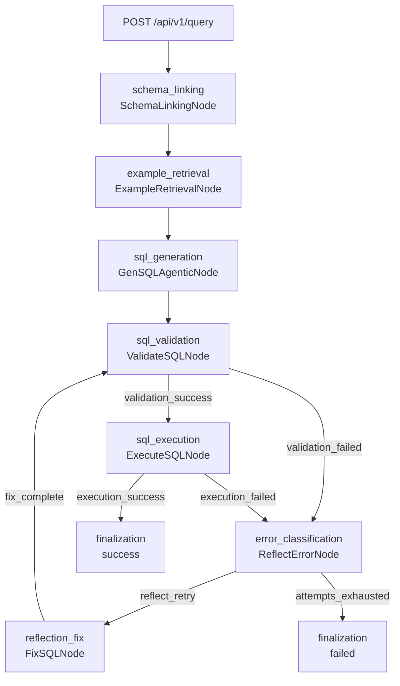

# 面试演示场景

本文档用于面试时快速展示 Text-to-SQL Agent Demo 的主链路、修复闭环和终止条件。`python scripts/run_demo.py` 中的所有场景都显式使用 `MockLLMClient`，不需要 API Key，也不依赖真实在线 LLM。直接启动 FastAPI 服务时会使用 `workflow.yaml` 的默认 OpenAI-compatible provider 配置，需要先准备对应环境变量。

## 运行方式

命令行运行三条内置场景：

```bash
python scripts/run_demo.py
```

或启动 API 后调用 `POST /api/v1/query`。这种方式会走默认 workflow 配置，请先配置 `DEEPSEEK_API_KEY` / `DEEPSEEK_BASE_URL`，或在测试代码中显式注入 `MockLLMClient`：

```bash
PYTHONPATH=src uvicorn text_to_sql_demo.main:app --reload
```

```bash
curl -X POST http://127.0.0.1:8000/api/v1/query \
  -H 'Content-Type: application/json' \
  -d '{
    "question": "统计每个地区的订单总金额。",
    "target_dialect": "sqlite",
    "max_attempts": 3,
    "debug": true
  }'
```

维护提示：如果启动方式、API 路径或 `scripts/run_demo.py` 的场景入参变化，需要同步更新本节和 README。

## 演示工作流图

先看 plaintext 版，面试讲解时直接照这个顺序说即可：

```text
┌──────────────────────────────────────────────────────────────────────────────┐
│                         面试演示主链路                                      │
└──────────────────────────────────────────────────────────────────────────────┘

                             ┌──────────────────────┐
                             │      用户问题         │
                             │ 自然语言查询          │
                             └───────────┬──────────┘
                                         │
                             ┌───────────▼──────────┐
                             │ Schema Linking       │
                             │ 选相关表和字段        │
                             └───────────┬──────────┘
                                         │
                             ┌───────────▼──────────┐
                             │ Example Retrieval    │
                             │ 检索 Top-K SQL 示例   │
                             └───────────┬──────────┘
                                         │
                             ┌───────────▼──────────┐
                             │ SQL Generation       │
                             │ 路由模型并生成 SQL    │
                             └───────────┬──────────┘
                                         │
                             ┌───────────▼──────────┐
                             │ SQL Validation       │
                             │ 方言/只读/Schema 校验 │
                             └──────┬─────────┬─────┘
                                    │         │
                              通过  │         │ 失败
                                    │         ▼
                                    │  ┌──────────────────────┐
                                    │  │ ReflectError         │
                                    │  │ 生成修复指令          │
                                    │  └──────┬─────────┬─────┘
                                    │         │         │
                                    │   可修复 │         │ 次数耗尽
                                    │         ▼         ▼
                                    │  ┌────────────┐  ┌──────────────────────┐
                                    │  │ FixSQL     │  │ Finalization failed  │
                                    │  │ 生成新 SQL  │  │ 返回失败和 Trace      │
                                    │  └─────┬──────┘  └──────────────────────┘
                                    │        │
                                    │        └───────────────回到 SQL Validation
                                    │
                                    ▼
                             ┌──────────────────────┐
                             │ SQL Execution        │
                             │ 执行 SQLite SELECT   │
                             └───────────┬──────────┘
                                         │
                             ┌───────────▼──────────┐
                             │ Finalization success │
                             │ 返回 SQL/结果/Trace   │
                             └──────────────────────┘
```

Mermaid 渲染版如下：



维护提示：plaintext 版和 Mermaid 版都要与 `workflow.yaml` 的 `edges` 保持一一对应；新增或重命名节点时不要只改 README，必须同步改本文档。

## Scenario A：复杂查询一次成功

问题：

> 统计每个地区订单金额最高的 3 个客户，返回地区、客户名称、总金额和地区内排名。

Mock SQL：

```sql
SELECT region, customer_name, total_amount, region_rank
FROM (
  SELECT region, customer_name, total_amount,
         RANK() OVER (PARTITION BY region ORDER BY total_amount DESC) AS region_rank
  FROM (
    SELECT r.name AS region, c.name AS customer_name, SUM(o.amount) AS total_amount
    FROM regions r
    JOIN customers c ON c.region_id = r.id
    JOIN orders o ON o.customer_id = c.id
    GROUP BY r.name, c.name
  ) totals
) ranked
WHERE region_rank <= 3
ORDER BY region, region_rank
```

演示点：

- `SchemaLinkingNode` 命中 `regions`、`customers`、`orders` 等相关表。
- `GenSQLAgenticNode` 内的 `ComplexityClassifier` 识别聚合、Top-N/排名和多表关联，路由到 `strong` alias。
- `PromptBuilder` 只注入 linked schema 和 Top-K examples。
- SQLGlot 校验通过，SQLite 执行成功，Trace 中不出现 `reflection_fix`。

维护提示：如果调整复杂度规则或 Scenario A 的 SQL，需要同步更新 `tests/integration/test_demo_scenarios.py` 的断言和本节说明。

## Scenario B：错误字段自动修复

问题：

> 统计每个地区的订单总金额。

第一次 Mock SQL：

```sql
SELECT region_id, SUM(total_amount) FROM orders GROUP BY region_id
```

真实情况：

- `orders` 表没有 `total_amount` 字段，真实字段是 `amount`。
- 地区名称需要通过 `orders -> customers -> regions` 关联得到。

修复后 SQL：

```sql
SELECT r.name AS region, SUM(o.amount) AS total_amount
FROM regions r
JOIN customers c ON c.region_id = r.id
JOIN orders o ON o.customer_id = c.id
GROUP BY r.name
ORDER BY r.name
```

演示点：

- `ValidateSQLNode` 产生 `unknown_column` 或 schema 相关错误。
- `ReflectErrorNode` 生成带 `RepairStrategy` 的结构化 `repair_instruction`，例如 `repair_unknown_column`。
- `FixSQLNode` 把定向策略注入 prompt，并记录 `old_sql`、`new_sql`、`error_type`、`reason` 和 `strategy_name`。
- 第二次校验和执行成功，响应中 `attempts=1`，`repair_history` 可展示修复前后 SQL。

维护提示：如果 schema 字段、校验错误类型或修复历史结构变化，需要同步更新本节、前端修复提示适配器和修复路径测试。

## Scenario C：达到终止条件

Mock LLM 每次都返回：

```sql
SELECT missing_amount FROM missing_orders
```

演示点：

- 每轮都会在 validation 阶段得到 schema 相关错误。
- `FixSQLNode` 持续产出仍然错误的 SQL。
- 修复尝试最多 3 次。
- 第 3 次后 `ReflectErrorNode` 返回 `attempts_exhausted`。
- `FinalizeNode` 返回失败状态，响应保留最后错误、最后 SQL、全部 `repair_history` 和完整 Trace。

维护提示：如果 `QueryRequest.max_attempts` 上限、默认最大修复次数或终止 reason 改变，需要同步更新本节、README 和 `tests/integration/test_demo_scenarios.py`。

## 面试讲解顺序

1. 先展示 Scenario A，说明系统能处理复杂查询并给出节点级 Trace。
2. 再展示 Scenario B，强调校验、反思和修复不是黑盒重试。
3. 最后展示 Scenario C，说明修复循环有明确终止条件，不会无限运行。
4. 如果有时间，打开前端开发者信息，展示模型 alias、Few-shot 示例和 Agent Trace。

维护提示：如果前端展示项发生变化，请同步更新最后一步，避免面试讲解和实际页面不一致。
